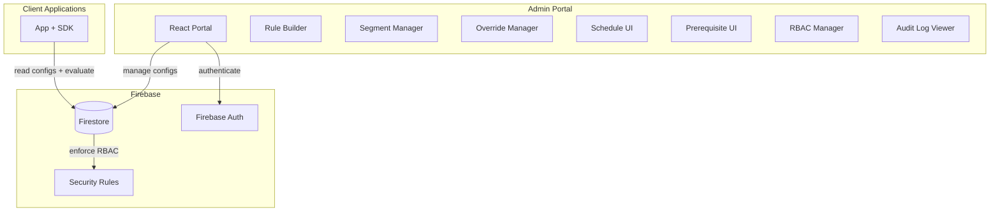
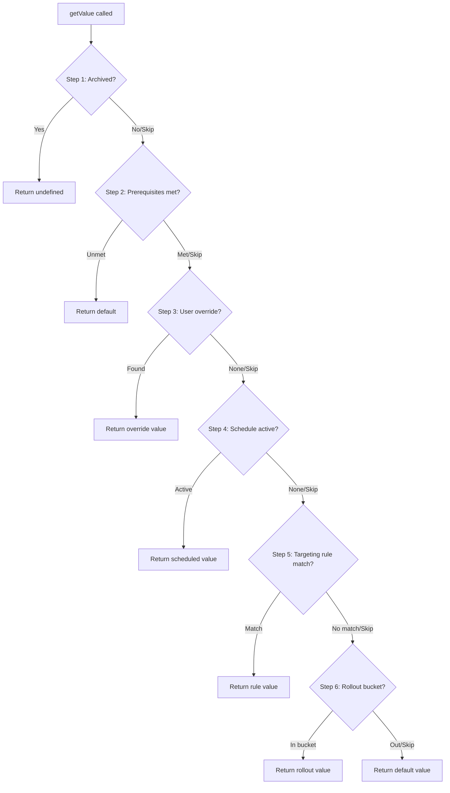
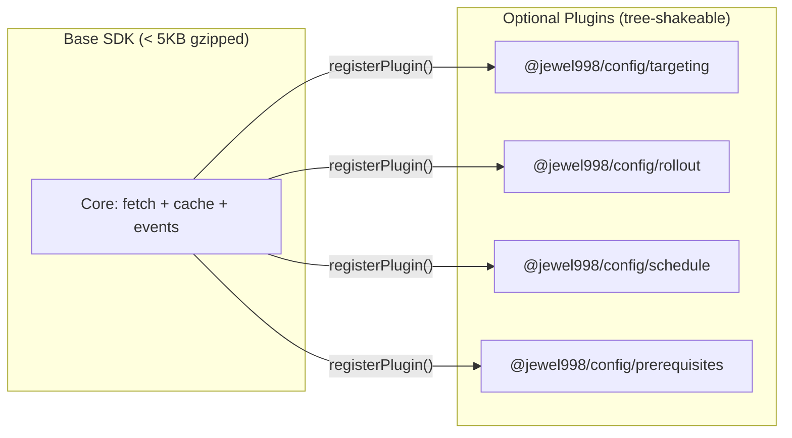

# Design Document: Advanced Feature Management

## Overview

This design describes the architecture for extending the `@jewel998/config` platform with advanced feature management capabilities: targeting rules, percentage rollouts, user segments, per-user overrides, flag lifecycle states, scheduled changes, prerequisite flags, RBAC, audit logging, and GDPR compliance.

The system operates across three layers:

1. **Firestore** — Data storage with security rules enforcing RBAC server-side
2. **SDK (`@jewel998/config`)** — Client-side evaluation pipeline with tree-shakeable plugin modules
3. **Portal (React admin)** — Management UI for rules, segments, schedules, RBAC, and audit

Key design constraints:
- No Cloud Functions — all evaluation logic is client-side (SDK or Portal)
- SDK must remain tree-shakeable; unused evaluation modules add zero bytes to bundles
- Firestore Security Rules enforce RBAC regardless of portal UI state
- Deterministic hashing for percentage rollouts ensures sticky bucketing
- Audit log is append-only at the Firestore level

## Architecture

### High-Level System Diagram



### SDK Evaluation Pipeline

The SDK evaluation pipeline processes a Config_Flag through an ordered sequence of plugin steps. Each step either produces a final value (short-circuiting the pipeline) or passes control to the next step.



### Plugin Architecture



## Components and Interfaces

### SDK Plugin System

```typescript
/** Pipeline step identifier — determines execution order */
export type PipelineStepId =
  | "archived"
  | "prerequisites"
  | "overrides"
  | "schedule"
  | "targeting"
  | "rollout";

/** The fixed execution order (per Requirement 11) */
export const PIPELINE_ORDER: PipelineStepId[] = [
  "archived",
  "prerequisites",
  "overrides",
  "schedule",
  "targeting",
  "rollout",
];

/** Evaluation context provided by the consumer */
export interface EvaluationContext {
  userId?: string;
  attributes?: Record<string, string | number | boolean | string[]>;
  consentGranted?: boolean;
}

/** Result from a pipeline step */
export type PipelineStepResult =
  | { resolved: true; value: unknown }
  | { resolved: false };

/** A registered evaluation plugin */
export interface EvaluationPlugin {
  /** Which pipeline step this plugin handles */
  stepId: PipelineStepId;

  /** Evaluate a config flag at this pipeline step */
  evaluate(
    flag: ConfigFlagData,
    context: EvaluationContext,
    helpers: PipelineHelpers,
  ): PipelineStepResult;
}

/** Helpers provided to plugins for cross-cutting concerns */
export interface PipelineHelpers {
  /** Evaluate another flag (for prerequisites) */
  evaluateFlag(key: string, context: EvaluationContext): unknown;
  /** Emit an event */
  emitError(message: string): void;
  /** Current timestamp (injectable for testing) */
  now(): number;
}

/** Extended config client options with plugin support */
export interface CreateConfigOptionsV2 extends CreateConfigOptions {
  /** Evaluation plugins to register */
  plugins?: EvaluationPlugin[];
  /** Evaluation context (can be updated later) */
  context?: EvaluationContext;
  /** Enable consent-aware mode (GDPR) */
  consentAware?: boolean;
}
```

### Config Flag Data Model (SDK-side)

```typescript
/** The full config flag document as fetched from Firestore */
export interface ConfigFlagData {
  key: string;
  value: unknown;
  valueType: "string" | "number" | "boolean" | "json";
  version: string;
  lifecycleState: "draft" | "active" | "stale" | "archived";

  // Targeting
  targetingRules?: TargetingRule[];

  // Rollout
  rolloutPercentage?: number; // 0-100
  rolloutValue?: unknown;

  // Overrides
  overrides?: Record<string, unknown>; // userId -> value

  // Schedule
  schedule?: {
    targetValue: unknown;
    activateAt: string; // ISO 8601 UTC
  };

  // Prerequisites
  prerequisites?: Array<{
    flagKey: string;
    requiredValue: unknown;
  }>;
}

/** A single targeting rule */
export interface TargetingRule {
  id: string;
  priority: number; // 1-1000
  value: unknown;
  conditions: PredicateGroup[]; // OR-combined groups (DNF)
}

/** A group of predicates combined with AND logic */
export interface PredicateGroup {
  predicates: Predicate[];
}

/** A single predicate */
export interface Predicate {
  attribute: string;
  operator: PredicateOperator;
  value: string | number | boolean | string[];
}

export type PredicateOperator =
  | "equals"
  | "not_equals"
  | "contains"
  | "starts_with"
  | "ends_with"
  | "in_list"
  | "not_in_list"
  | "greater_than"
  | "less_than"
  | "regex_match"
  | "in_segment"
  | "not_in_segment";
```

### Segment Data Model

```typescript
/** A reusable audience segment */
export interface Segment {
  id: string;
  name: string; // max 100 chars
  description: string; // max 500 chars
  conditions: PredicateGroup[]; // OR-combined groups (DNF), max 20 predicates total
  createdAt: string;
  updatedAt: string;
  createdBy: string;
}
```

### Hashing Module (Rollout)

```typescript
/**
 * Deterministic percentage rollout using MurmurHash3 (32-bit).
 *
 * Algorithm:
 * 1. Concatenate: `${configKey}:${userId}`
 * 2. Compute MurmurHash3_x86_32 with seed 0
 * 3. Map to bucket: Math.abs(hash) % 100
 * 4. Compare: bucket < rolloutPercentage → included
 *
 * This is the same approach used by flagd (OpenFeature), LaunchDarkly,
 * and other feature flag systems for deterministic bucketing.
 */
export function computeBucket(configKey: string, userId: string): number;
```

### Portal Components

| Component | Purpose | Route |
|-----------|---------|-------|
| `RuleBuilder` | Visual targeting rule editor with predicate groups | `/projects/$id/envs/$envId/configs/$key/rules` |
| `SegmentManager` | CRUD for segments with predicate editor | `/projects/$id/segments` |
| `OverrideManager` | Per-user override table with add/edit/remove | `/projects/$id/envs/$envId/configs/$key/overrides` |
| `ScheduleUI` | Schedule form with date/time picker + countdown | `/projects/$id/envs/$envId/configs/$key/schedule` |
| `PrerequisiteUI` | Prerequisite flag selector with cycle detection | `/projects/$id/envs/$envId/configs/$key/prerequisites` |
| `RBACManager` | Team member list with role assignment | `/projects/$id/settings/team` |
| `AuditLogViewer` | Filterable, paginated audit log | `/projects/$id/audit` |
| `LifecycleStateBadge` | State indicator with transition controls | Config detail view |
| `GDPRPanel` | Data export + deletion request UI | `/projects/$id/settings/gdpr` |

### RBAC Model

```typescript
/** RBAC roles stored in the project document */
export interface ProjectWithRBAC {
  id: string;
  name: string;
  ownerId: string;
  /** Map of userId -> role */
  roles: Record<string, "viewer" | "editor" | "admin">;
  authorizedUsers: string[];
  // ... other fields
}
```

The `roles` map replaces the simple `authorizedUsers` array for access control. The `authorizedUsers` array is retained for backward compatibility (contains all user IDs regardless of role).

### Audit Log Entry

```typescript
export interface AuditEntry {
  id: string;
  actorId: string;
  timestamp: string; // ISO 8601 UTC
  action: "create" | "update" | "delete" | "state_change" | "data_deletion";
  resourcePath: string; // e.g., "environments/env1/configs/feature.beta"
  oldValue?: string; // JSON-serialized, max 10,000 chars
  newValue?: string; // JSON-serialized, max 10,000 chars
  metadata?: Record<string, string>; // additional context
}
```

## Data Models

### Firestore Collection Structure

```
projects/{projectId}
├── name, ownerId, roles, authorizedUsers, staleDurationDays, auditRetentionDays, ...
├── environments/{envId}
│   ├── name, isProduction, allowedDomains, color, ...
│   └── configs/{key}
│       ├── key, value, valueType, version, lifecycleState
│       ├── targetingRules[]  (embedded array)
│       ├── rolloutPercentage, rolloutValue
│       ├── overrides{}  (embedded map)
│       ├── schedule{}   (embedded object)
│       ├── prerequisites[]  (embedded array)
│       ├── publishedAt, updatedAt, updatedBy, locked
│       └── stateChangedAt
├── segments/{segmentId}
│   ├── name, description, conditions[], createdAt, updatedAt, createdBy
└── audit_log/{entryId}
    ├── actorId, timestamp, action, resourcePath, oldValue, newValue, metadata
```

### Extended Config Document Schema

```typescript
// Firestore: projects/{projectId}/environments/{envId}/configs/{key}
interface ConfigDocument {
  // Existing fields
  key: string;
  value: unknown;
  valueType: "string" | "number" | "boolean" | "json";
  version: string;
  publishedAt: string;
  updatedAt: string;
  updatedBy: string;
  locked?: boolean;

  // New fields
  lifecycleState: "draft" | "active" | "stale" | "archived";
  stateChangedAt: string; // ISO 8601

  targetingRules?: Array<{
    id: string;
    priority: number;
    value: unknown;
    conditions: Array<{
      predicates: Array<{
        attribute: string;
        operator: string;
        value: unknown;
      }>;
    }>;
  }>;

  rolloutPercentage?: number;
  rolloutValue?: unknown;

  overrides?: Record<string, unknown>; // userId -> value

  schedule?: {
    targetValue: unknown;
    activateAt: string; // ISO 8601 UTC
  };

  prerequisites?: Array<{
    flagKey: string;
    requiredValue: unknown;
  }>;
}
```

### Segment Document Schema

```typescript
// Firestore: projects/{projectId}/segments/{segmentId}
interface SegmentDocument {
  name: string; // max 100 chars
  description: string; // max 500 chars
  conditions: Array<{
    predicates: Array<{
      attribute: string;
      operator: string;
      value: unknown;
    }>;
  }>;
  createdAt: string;
  updatedAt: string;
  createdBy: string;
}
```

### Audit Log Document Schema

```typescript
// Firestore: projects/{projectId}/audit_log/{entryId}
interface AuditLogDocument {
  actorId: string;
  timestamp: string; // ISO 8601 UTC
  action: "create" | "update" | "delete" | "state_change" | "data_deletion";
  resourcePath: string;
  oldValue?: string; // JSON-serialized, max 10,000 chars
  newValue?: string; // JSON-serialized, max 10,000 chars
  metadata?: Record<string, string>;
}
```

### Firestore Security Rules (RBAC-Extended)

```javascript
rules_version = '2';

service cloud.firestore {
  match /databases/{database}/documents {

    match /projects/{projectId} {
      // Read: any authenticated project member
      allow read: if request.auth != null && isProjectMember(projectId);
      allow create: if request.auth != null;
      // Update/delete: admin only
      allow update, delete: if request.auth != null && hasRole(projectId, 'admin');

      // Environments
      match /environments/{environmentId} {
        allow read: if request.auth != null && isProjectMember(projectId);
        // Non-production: editor or admin
        allow create, update, delete: if request.auth != null
          && (hasRole(projectId, 'admin')
              || (hasRole(projectId, 'editor')
                  && !resource.data.isProduction));

        // Configs
        match /configs/{configKey} {
          allow read: if request.auth != null && isProjectMember(projectId);
          // Write: editor (non-prod) or admin (all)
          allow create, update: if request.auth != null
            && (hasRole(projectId, 'admin')
                || (hasRole(projectId, 'editor')
                    && !getEnvironment(projectId, environmentId).data.isProduction));
          allow delete: if request.auth != null && hasRole(projectId, 'admin');
        }

        // Client IDs
        match /clientIds/{clientIdToken} {
          allow read: if request.auth != null && isProjectMember(projectId);
          allow create, update, delete: if request.auth != null
            && hasRole(projectId, 'admin');
        }
      }

      // Segments
      match /segments/{segmentId} {
        allow read: if request.auth != null && isProjectMember(projectId);
        allow create, update, delete: if request.auth != null
          && (hasRole(projectId, 'admin')
              || hasRole(projectId, 'editor'));
      }

      // Audit log — append-only, no modify/delete
      match /audit_log/{entryId} {
        allow read: if request.auth != null && isProjectMember(projectId);
        allow create: if request.auth != null && isProjectMember(projectId);
        allow update, delete: if false;
      }
    }

    // Rate limits
    match /rateLimits/{clientId} {
      allow read, write: if false;
    }

    // Allowed users
    match /allowedUsers/{email} {
      allow read: if request.auth != null && request.auth.token.email == email;
      allow write: if false;
    }

    // Helper functions
    function isProjectMember(projectId) {
      let project = get(/databases/$(database)/documents/projects/$(projectId));
      return !('deletedAt' in project.data)
        && (project.data.ownerId == request.auth.uid
            || request.auth.uid in project.data.authorizedUsers);
    }

    function hasRole(projectId, role) {
      let project = get(/databases/$(database)/documents/projects/$(projectId));
      let roles = project.data.roles;
      let uid = request.auth.uid;
      // Owner always has admin
      if (project.data.ownerId == uid) { return true; }
      // Check roles map
      if (!(uid in roles)) { return false; }
      if (role == 'viewer') { return true; } // any role implies viewer
      if (role == 'editor') { return roles[uid] == 'editor' || roles[uid] == 'admin'; }
      if (role == 'admin') { return roles[uid] == 'admin'; }
      return false;
    }

    function getEnvironment(projectId, envId) {
      return get(/databases/$(database)/documents/projects/$(projectId)/environments/$(envId));
    }
  }
}
```

### MurmurHash3 Implementation

The SDK uses MurmurHash3 (32-bit, x86 variant) for deterministic percentage rollout bucketing. This is the same algorithm used by [flagd (OpenFeature)](https://flagd.dev/architecture-decisions/fractional) and other feature flag systems.

```typescript
/**
 * MurmurHash3_x86_32
 * Public domain — Austin Appleby
 * Adapted for TypeScript (operates on UTF-8 encoded string bytes)
 */
export function murmurhash3_32(key: string, seed: number = 0): number {
  const encoder = new TextEncoder();
  const bytes = encoder.encode(key);
  const len = bytes.length;
  let h1 = seed >>> 0;
  const c1 = 0xcc9e2d51;
  const c2 = 0x1b873593;

  let i = 0;
  while (i + 4 <= len) {
    let k1 =
      (bytes[i] | (bytes[i + 1] << 8) | (bytes[i + 2] << 16) | (bytes[i + 3] << 24)) >>> 0;
    k1 = Math.imul(k1, c1) >>> 0;
    k1 = ((k1 << 15) | (k1 >>> 17)) >>> 0;
    k1 = Math.imul(k1, c2) >>> 0;
    h1 ^= k1;
    h1 = ((h1 << 13) | (h1 >>> 19)) >>> 0;
    h1 = (Math.imul(h1, 5) + 0xe6546b64) >>> 0;
    i += 4;
  }

  let k1 = 0;
  switch (len & 3) {
    case 3: k1 ^= bytes[i + 2] << 16;
    // falls through
    case 2: k1 ^= bytes[i + 1] << 8;
    // falls through
    case 1:
      k1 ^= bytes[i];
      k1 = Math.imul(k1, c1) >>> 0;
      k1 = ((k1 << 15) | (k1 >>> 17)) >>> 0;
      k1 = Math.imul(k1, c2) >>> 0;
      h1 ^= k1;
  }

  h1 ^= len;
  // fmix32
  h1 ^= h1 >>> 16;
  h1 = Math.imul(h1, 0x85ebca6b) >>> 0;
  h1 ^= h1 >>> 13;
  h1 = Math.imul(h1, 0xc2b2ae35) >>> 0;
  h1 ^= h1 >>> 16;

  return h1 >>> 0;
}

/**
 * Compute the rollout bucket (0-99) for a given configKey and userId.
 */
export function computeBucket(configKey: string, userId: string): number {
  const input = `${configKey}:${userId}`;
  const hash = murmurhash3_32(input, 0);
  return hash % 100;
}
```

### GDPR Data Flows

**Data Export Flow:**
1. Admin initiates export for a userId via Portal GDPR panel
2. Portal queries all projects the admin has access to
3. For each project: collects overrides mentioning userId, audit entries with actorId = userId, and segment membership references
4. Serializes to JSON and offers browser download
5. Must complete within 60 seconds

**Data Deletion Flow:**
1. Admin initiates deletion request for a userId
2. Portal iterates all accessible projects and environments
3. Removes override entries keyed by userId from config documents
4. Anonymizes actorId in audit entries (replaces with hashed identifier)
5. Removes the userId from `authorizedUsers` and `roles` maps
6. Logs the deletion action in audit log with anonymized target
7. Must complete within 72 hours (displayed as pending until done)

### SDK Initialization Example

```typescript
import { createConfig } from "@jewel998/config";
import { browserStorage } from "@jewel998/config/storage";
import { targetingPlugin } from "@jewel998/config/targeting";
import { rolloutPlugin } from "@jewel998/config/rollout";
import { schedulePlugin } from "@jewel998/config/schedule";
import { prerequisitePlugin } from "@jewel998/config/prerequisites";

const client = createConfig({
  clientId: "cid_abc123",
  storage: browserStorage(),
  plugins: [
    targetingPlugin(),
    rolloutPlugin(),
    schedulePlugin(),
    prerequisitePlugin(),
  ],
  context: {
    userId: "user-42",
    attributes: {
      plan: "enterprise",
      country: "US",
    },
    consentGranted: true,
  },
  consentAware: true,
});

// Evaluation respects the full pipeline
const value = client.getValue("feature.new-dashboard");
```


## Correctness Properties

*A property is a characteristic or behavior that should hold true across all valid executions of a system — essentially, a formal statement about what the system should do. Properties serve as the bridge between human-readable specifications and machine-verifiable correctness guarantees.*

### Property 1: Pipeline evaluation order and short-circuit

*For any* Config_Flag with data configured for multiple pipeline steps (overrides, schedule, targeting rules, rollout) and *for any* Evaluation_Context, the Rule_Evaluator SHALL return the value from the highest-priority step (per the fixed order: archived → prerequisites → overrides → schedule → targeting → rollout → default) that produces a result, without evaluating lower-priority steps.

**Validates: Requirements 11.1, 11.2, 11.3**

### Property 2: Targeting rules priority ordering

*For any* set of Targeting_Rules with distinct priority numbers and *for any* Evaluation_Context that matches multiple rules, the Rule_Evaluator SHALL return the value of the rule with the lowest priority number (highest priority).

**Validates: Requirements 1.1**

### Property 3: DNF predicate evaluation

*For any* Targeting_Rule with predicate groups structured in Disjunctive Normal Form (OR of ANDs) and *for any* Evaluation_Context, the rule matches if and only if at least one predicate group has all its predicates satisfied by the context attributes.

**Validates: Requirements 1.5**

### Property 4: Missing attribute or type mismatch yields non-matching predicate

*For any* predicate referencing an attribute name not present in the Evaluation_Context, or where the attribute value type is incompatible with the operator (e.g., `greater_than` applied to a non-numeric value), the predicate SHALL evaluate to false without throwing an error.

**Validates: Requirements 1.6**

### Property 5: Rollout bucket determinism and stickiness

*For any* userId and configKey strings, the `computeBucket(configKey, userId)` function SHALL always return the same integer in [0, 99] across any number of invocations, sessions, or SDK initializations.

**Validates: Requirements 2.2, 2.5**

### Property 6: Rollout inclusion threshold

*For any* Config_Flag with a Rollout_Percentage between 1 and 99, and *for any* Evaluation_Context with a userId, the Rule_Evaluator returns the rollout-enabled value if and only if `computeBucket(configKey, userId) < rolloutPercentage`.

**Validates: Requirements 2.3, 2.4**

### Property 7: Missing userId skips user-dependent steps

*For any* Config_Flag with overrides and/or rollout configured, and *for any* Evaluation_Context without a userId, the Rule_Evaluator SHALL skip the per-user overrides step and the percentage rollout step entirely, proceeding directly to the next applicable step.

**Validates: Requirements 2.6, 4.5, 11.6**

### Property 8: Segment resolution consistency

*For any* Segment definition with predicate groups and *for any* Evaluation_Context, the segment evaluation result SHALL equal the DNF logical evaluation of the segment's predicate groups against the context, using the same predicate operators as Targeting_Rules. Intermediate predicate results must be consistent with the final segment match outcome.

**Validates: Requirements 3.4**

### Property 9: Override bypass

*For any* Config_Flag with an overrides map containing a userId entry with a non-null value, and *for any* Evaluation_Context with that userId, the Rule_Evaluator SHALL return the override value immediately, bypassing all subsequent pipeline steps (targeting rules, rollout, schedule).

**Validates: Requirements 4.3**

### Property 10: Lifecycle state machine validity

*For any* current lifecycle state and *for any* attempted target state, the transition succeeds if and only if the (current, target) pair is in the set: {(draft, active), (active, stale), (stale, archived), (stale, active), (archived, active)}. All other transitions SHALL be rejected.

**Validates: Requirements 5.3, 5.4**

### Property 11: Archived flag returns undefined

*For any* Config_Flag in the "archived" lifecycle state, regardless of configured targeting rules, overrides, rollout, schedule, or prerequisites, the Rule_Evaluator SHALL return undefined.

**Validates: Requirements 5.6**

### Property 12: Schedule activation based on time comparison

*For any* Config_Flag with a schedule, the Rule_Evaluator returns the schedule's targetValue if and only if the schedule's activateAt timestamp is in the past relative to the current evaluation time. If activateAt is in the future, the schedule is ignored and evaluation proceeds to the next pipeline step.

**Validates: Requirements 6.4, 6.5**

### Property 13: Prerequisite failure returns default

*For any* Config_Flag with prerequisites, if any prerequisite flag does not return its specified required value when evaluated, the Rule_Evaluator SHALL return the dependent flag's default value without evaluating the dependent flag's own targeting rules, overrides, or rollout.

**Validates: Requirements 7.4**

### Property 14: Circular dependency detection

*For any* set of Config_Flags where prerequisite evaluation would form a cycle (A requires B requires A, or longer chains), the Rule_Evaluator SHALL detect the cycle, return the Config_Flag default value, and emit a "fetchError" event with a circular dependency message.

**Validates: Requirements 7.5**

### Property 15: RBAC write access rule

*For any* user with an assigned RBAC_Role and *for any* environment, write access to configs in that environment is granted if and only if: (role = "admin") OR (role = "editor" AND environment.isProduction = false). Viewers have no write access. This holds regardless of portal UI state.

**Validates: Requirements 8.3, 8.4, 8.5**

### Property 16: Consent-aware mode enforcement

*For any* Config_Flag evaluation when the SDK is initialized with `consentAware: true`, if the Evaluation_Context does not contain `consentGranted` set to `true` (including when the property is missing or explicitly false), the Rule_Evaluator SHALL return only default values without evaluating targeting rules, overrides, percentage rollouts, schedules, or prerequisites.

**Validates: Requirements 10.5, 10.6**

### Property 17: PII pattern detection

*For any* string value being saved as a config value, the PII detection function SHALL correctly identify strings matching common PII formats (email addresses matching `*@*.*`, phone numbers matching international formats, government ID patterns) and return a warning indicator, while non-PII strings produce no warning.

**Validates: Requirements 10.7**

### Property 18: Audit entry completeness on modification

*For any* config modification operation (create, update, delete, state_change) that succeeds, an Audit_Entry SHALL be created containing: actor userId, ISO 8601 UTC timestamp, action type, old value, new value, and affected resource path. The absence of the audit entry must block the modification.

**Validates: Requirements 9.1, 9.6**

### Property 19: Stale detection based on configurable duration

*For any* Config_Flag in "active" state whose most recent modification (value, targeting rules, overrides, rollout percentage, or schedule) occurred more than `staleDurationDays` ago, the system SHALL transition the flag to "stale" state. Flags modified within the duration SHALL remain "active".

**Validates: Requirements 5.7**

### Property 20: Plugin registration order independence

*For any* set of evaluation plugins registered in any order during SDK initialization, the evaluation pipeline SHALL execute the plugins in the fixed pipeline order (archived → prerequisites → overrides → schedule → targeting → rollout), not the registration order.

**Validates: Requirements 12.6**

### Property 21: Unregistered plugin step is skipped

*For any* pipeline step whose corresponding plugin module has not been registered, the Rule_Evaluator SHALL transparently skip that step and proceed to the next step in the pipeline order.

**Validates: Requirements 12.5**

### Property 22: No targeting rule match returns default

*For any* Config_Flag with targeting rules and *for any* Evaluation_Context that does not satisfy any targeting rule's predicate conditions, the Rule_Evaluator SHALL return the Config_Flag default value.

**Validates: Requirements 1.2**

### Property 23: Data deletion completeness

*For any* userId subject to a data deletion request, after deletion completes, no override entries keyed by that userId, no unmasked audit log actor references for that userId, and no access records for that userId SHALL remain across all projects.

**Validates: Requirements 10.2**

## Error Handling

### SDK Error Handling

| Error Condition | Behavior | Event Emitted |
|----------------|----------|---------------|
| Invalid regex in predicate | Predicate evaluates to false | `fetchError` with invalid pattern message |
| Circular prerequisite dependency | Return default value | `fetchError` with circular dependency message |
| Prerequisite depth > 5 | Return default value | `fetchError` with depth-exceeded message |
| Non-existent segment reference | Predicate evaluates to false | None (silent skip) |
| Non-existent/archived prerequisite | Treat as unmet, return default | None (silent skip) |
| Missing userId (overrides/rollout) | Skip those pipeline steps | None (expected flow) |
| Null/undefined override value | Skip override entry | None (expected flow) |
| Archived flag evaluation | Return undefined | None (expected flow) |
| Network error during fetch | Fall back to cache/default | `fetchError` with retry info |

### Portal Error Handling

| Error Condition | Behavior |
|----------------|----------|
| RBAC permission denied (Firestore) | Display "insufficient permissions" toast, preserve unsaved input |
| Audit write failure | Block the config modification, display error, discard pending change |
| Circular dependency on save | Reject save, display chain of flags forming the cycle |
| Type mismatch (override/schedule value) | Reject save, display type mismatch error |
| Segment deletion with references | Block deletion, list referencing Config_Flags |
| Schedule timestamp < 1 min future | Reject save, display "must be at least 1 minute in the future" |
| Invalid state transition | Reject transition, display "transition not allowed" error |
| Last admin removal attempt | Reject operation, display "at least one admin required" |
| GDPR export/deletion partial failure | Display failed resources, retain request in pending state for retry |
| PII detection in value | Display warning with detected PII type, block save unless acknowledged |
| Override limit exceeded (>100) | Reject addition, display limit error |
| Targeting rule limit exceeded (>100) | Reject addition, display limit error |

## Testing Strategy

### Property-Based Testing (PBT)

The evaluation pipeline, hashing, predicate logic, and state machine are ideal candidates for property-based testing. The pure-function nature of these components allows 100+ iterations to discover edge cases.

**Library:** [fast-check](https://github.com/dubzzz/fast-check) (TypeScript, mature, well-integrated with Vitest)

**Configuration:**
- Minimum 100 iterations per property test
- Each test tagged with: `Feature: advanced-feature-management, Property {N}: {title}`
- Tests run via `vitest run` in the SDK package

**Modules to test with PBT:**
1. `evaluatePipeline()` — Properties 1, 7, 11, 16, 20, 21, 22
2. `evaluateTargetingRules()` — Properties 2, 3, 4
3. `computeBucket()` / `murmurhash3_32()` — Properties 5, 6
4. `resolveSegment()` — Property 8
5. `evaluateOverrides()` — Property 9
6. `validateStateTransition()` — Property 10
7. `evaluateSchedule()` — Property 12
8. `evaluatePrerequisites()` — Properties 13, 14
9. `checkRBACAccess()` — Property 15
10. `detectPII()` — Property 17
11. `detectStaleFlags()` — Property 19
12. `deleteUserData()` — Property 23

### Unit Tests (Example-Based)

Focus on concrete scenarios, edge cases, and integration points:

- Portal UI components (rule builder, segment manager, RBAC manager, etc.)
- Boundary conditions (0% rollout, 100% rollout, exactly 100 overrides, depth 5 vs 6 prerequisites)
- Error scenarios (invalid regex, null override values, non-existent segments)
- Validation logic (type checking, character limits, timestamp constraints)
- Countdown timer and state display logic

### Integration Tests

- Firestore Security Rules enforcement (using Firestore emulator)
- Audit log append-only enforcement
- RBAC role-based write rejection
- Data export/deletion flows against Firestore emulator
- Segment update propagation

### Smoke Tests

- SDK bundle size verification (base < 5KB gzipped)
- Package.json exports field correctness
- `sideEffects: false` declaration
- Tree-shaking verification with esbuild/Rollup
