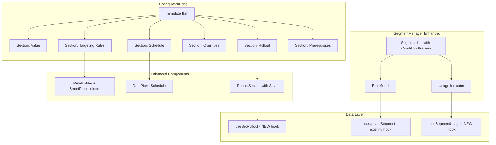
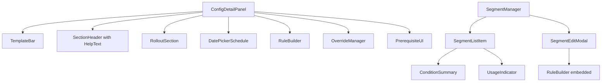
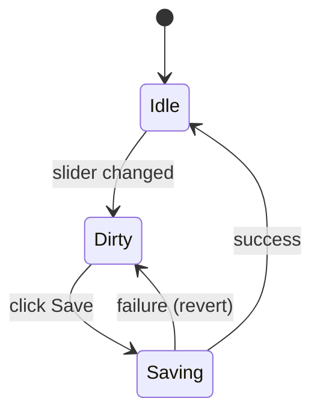

# Design Document: Config UX Overhaul

## Overview

This design covers a comprehensive UX overhaul of the Config Portal's advanced feature management UI. The changes span nine requirement areas: replacing the raw `datetime-local` input with a shadcn Calendar date picker, adding section help text and contextual hints, providing config templates for common patterns, adding smart placeholders to the rule builder, enabling segment editing, showing segment usage indicators, visualizing segment conditions inline, fixing the rollout percentage save flow, and improving visual hierarchy across the ConfigDetailPanel.

The overhaul is scoped to the portal's existing React 19 + TypeScript stack, building on top of shadcn/ui (Radix primitives), TanStack Query mutations, Firebase/Firestore, Zustand, and lingui i18n. No new backend services are introduced — all changes operate against existing Firestore document structures with minimal schema additions.

### Design Goals

- Improve discoverability of advanced features through contextual help and templates
- Reduce friction for common config workflows (targeting, rollout, scheduling)
- Fix broken persistence in the rollout section
- Enable full CRUD on segments with usage awareness
- Maintain existing RBAC enforcement patterns
- Preserve i18n compatibility via lingui macros

## Architecture



### Component Hierarchy



## Components and Interfaces

### New Components

#### 1. DatePickerSchedule

Replaces the raw `<input type="datetime-local">` in `ScheduleUI`. Uses shadcn `Calendar` (react-day-picker) inside a `Popover` with a separate time input.

```typescript
interface DatePickerScheduleProps {
  schedule?: { targetValue: unknown; activateAt: string } | null;
  onSave: (
    schedule: { targetValue: unknown; activateAt: string } | null,
  ) => void;
  disabled?: boolean;
}
```

**Implementation Notes:**

- Install shadcn Calendar component (`npx shadcn@latest add calendar`)
- Calendar rendered inside a `Popover` triggered by a `Button` displaying the formatted date
- Time selection via two `Select` dropdowns (hours 00–23, minutes 00–59)
- Past dates disabled via `disabled` prop on react-day-picker (`disabled: { before: new Date() }`)
- Selected date + time combined into ISO 8601 string on confirm
- Existing countdown display and pending/applied badge logic preserved

#### 2. TemplateBar

Horizontal row of template action buttons rendered above collapsible sections.

```typescript
interface TemplateBarProps {
  config: ConfigEntry;
  projectId: string;
  environmentId: string;
  canEdit: boolean;
  targetingRules: TargetingRule[];
  rolloutPercentage?: number;
  overrides: Record<string, unknown>;
  schedule?: { targetValue: unknown; activateAt: string } | null;
  onApplyTemplate: (template: TemplateType) => void;
}

type TemplateType =
  "beta-users" | "gradual-rollout" | "internal-only" | "scheduled-launch";
```

**Behavior:**

- Each button applies a pre-built config pattern
- If target section already has data, shows a confirmation `Dialog` before overwriting
- Buttons disabled when `canEdit === false`
- Templates i18n'd via lingui `t` macro

#### 3. RolloutSection

Extracts rollout logic from inline JSX into a dedicated component with proper save flow.

```typescript
interface RolloutSectionProps {
  rolloutPercentage: number;
  rolloutValue: unknown;
  configValue: unknown;
  projectId: string;
  environmentId: string;
  configKey: string;
  canEdit: boolean;
}
```

**State Machine:**



- Local state tracks `pendingPercentage` during drag
- On pointer-up / blur, show "Save" button
- Save triggers `useSetRollout` mutation
- On error: revert slider, show error toast
- On success: dismiss Save button, show success toast
- Loading state disables slider + shows spinner on button

#### 4. SectionHelpText

Renders muted description and optional tip below section headers.

```typescript
interface SectionHelpTextProps {
  sectionId: SectionId;
  hasActiveConfig?: boolean;
}
```

Returns a `<p>` with the static description text and conditionally a "Tip:" line and "Learn more" tooltip.

#### 5. ConditionSummary

Inline visualization of segment predicate conditions.

```typescript
interface ConditionSummaryProps {
  conditions: PredicateGroup[];
  maxGroups?: number; // defaults to 1, shows "+N more" for rest
}
```

Renders predicates as `attribute operator value` joined by "AND", with "OR" between groups.

#### 6. UsageIndicator

Shows how many configs reference a segment.

```typescript
interface UsageIndicatorProps {
  segmentId: string;
  projectId: string;
  environmentId: string;
}
```

Uses `useSegmentUsage` hook to compute references. Renders as a badge with count, expandable to show config key list.

#### 7. SegmentEditModal

Modal for editing segment name, description, and conditions.

```typescript
interface SegmentEditModalProps {
  segment: Segment;
  open: boolean;
  onOpenChange: (open: boolean) => void;
  onSave: (data: {
    name: string;
    description: string;
    conditions: PredicateGroup[];
  }) => void;
  disabled?: boolean;
}
```

Uses `ResponsiveModal` wrapper (existing pattern). Embeds a simplified `RuleBuilder` for conditions editing. Validates that name is non-empty before allowing save.

### Modified Components

#### ConfigDetailPanel

- Adds `<TemplateBar>` above the accordion sections
- Replaces inline `SectionHeader` button with enhanced version that includes `SectionHelpText`
- Adds left border accent (`border-l-2 border-l-primary/10`) to each section wrapper
- Adds `min-h-[8px]` gap between sections (already `space-y-1`, upgrade to `space-y-2`)
- Replaces inline Rollout JSX with `<RolloutSection>`
- Replaces `<ScheduleUI>` with `<DatePickerSchedule>`

#### RuleBuilder (Smart Placeholders)

- Attribute input gets `placeholder="e.g., plan, country, email, userId"`
- Adds autocomplete datalist with common attributes
- Operator select items get descriptions (e.g., "equals — exact match")
- New rules default first predicate to `{ attribute: "plan", operator: "equals", value: "" }`
- Value input placeholder changes based on selected operator

#### SegmentManager

- Segment list items become clickable (opens `SegmentEditModal`)
- Replaces "N groups" badge with `<ConditionSummary>`
- Adds `<UsageIndicator>` badge per segment
- Delete action shows warning dialog when usage count > 0

### New Hooks

#### useSetRollout

```typescript
export const useSetRollout = () => {
  // Same pattern as useSetOverrides / useSetSchedule
  // Updates: rolloutPercentage, rolloutValue, updatedAt, updatedBy
  // Writes audit entry before update
};
```

#### useSegmentUsage

```typescript
export const useSegmentUsage = (
  projectId: string | null,
  environmentId: string | null,
  segmentId: string,
) => {
  return useQuery({
    queryKey: ["segment-usage", projectId, environmentId, segmentId],
    queryFn: async () => {
      // Fetch all configs for the project/environment
      // Filter configs whose targetingRules contain predicates with
      // operator "in_segment" or "not_in_segment" and value === segmentId
      // Return { count: number, configKeys: string[] }
    },
    enabled: !!projectId && !!environmentId,
  });
};
```

## Data Models

### Existing Firestore Schema (unchanged)

```
projects/{projectId}/segments/{segmentId}
  - id: string
  - name: string
  - description: string
  - conditions: PredicateGroup[]
  - createdAt: string (ISO 8601)
  - updatedAt: string (ISO 8601)
  - createdBy: string (uid)

projects/{projectId}/environments/{envId}/configs/{key}
  - key: string
  - value: unknown
  - valueType: "string" | "number" | "boolean" | "json" | "array"
  - version: string
  - publishedAt: string
  - updatedAt: string
  - updatedBy: string
  - locked?: boolean
  - targetingRules?: TargetingRule[]
  - rolloutPercentage?: number
  - rolloutValue?: unknown
  - overrides?: Record<string, unknown>
  - schedule?: { targetValue: unknown; activateAt: string }
  - prerequisites?: Array<{ flagKey: string; requiredValue: unknown }>
```

### New TypeScript Interfaces

```typescript
/** Template definition for the TemplateBar */
interface ConfigTemplate {
  id: TemplateType;
  label: string; // i18n via t macro
  icon: LucideIcon;
  description: string; // tooltip text
  apply: (config: ConfigEntry) => TemplateResult;
}

interface TemplateResult {
  targetingRules?: TargetingRule[];
  rolloutPercentage?: number;
  rolloutValue?: unknown;
  overrides?: Record<string, unknown>;
  schedule?: { targetValue: unknown; activateAt: string };
}

/** Segment usage computation result */
interface SegmentUsageResult {
  count: number;
  configKeys: string[];
}

/** Section help text configuration */
interface SectionHelpConfig {
  description: string;
  tip?: string;
  learnMoreUrl?: string;
}

/** Map of section IDs to help configuration */
const SECTION_HELP: Record<SectionId, SectionHelpConfig> = {
  value: {
    description: "The current resolved value for this config key.",
  },
  targeting: {
    description:
      "Route specific config values to users based on attributes like plan, country, or custom properties.",
    tip: "Rules are evaluated top-to-bottom by priority. First match wins.",
    learnMoreUrl: "/docs/targeting",
  },
  rollout: {
    description:
      "Gradually roll out this config value to a percentage of users.",
    tip: "Rollout uses consistent hashing — the same user always gets the same result.",
    learnMoreUrl: "/docs/rollout",
  },
  overrides: {
    description:
      "Force a specific value for individual user IDs, bypassing all other rules.",
    learnMoreUrl: "/docs/overrides",
  },
  schedule: {
    description:
      "Automatically change this config's value at a future date and time.",
    learnMoreUrl: "/docs/schedule",
  },
  prerequisites: {
    description:
      "Require other flags to have specific values before this config takes effect.",
    tip: "Circular dependencies are blocked automatically.",
    learnMoreUrl: "/docs/prerequisites",
  },
};

/** Operator description map for smart placeholders */
const OPERATOR_DESCRIPTIONS: Record<PredicateOperator, string> = {
  equals: "exact match",
  not_equals: "does not match",
  contains: "substring match",
  starts_with: "begins with value",
  ends_with: "ends with value",
  in_list: "matches any in comma-separated list",
  not_in_list: "matches none in comma-separated list",
  greater_than: "numeric greater than",
  less_than: "numeric less than",
  regex_match: "matches regex pattern",
  in_segment: "user belongs to segment",
  not_in_segment: "user does not belong to segment",
};

/** Common attribute suggestions for autocomplete */
const COMMON_ATTRIBUTES = [
  "plan",
  "country",
  "email",
  "userId",
  "device",
  "browser",
  "appVersion",
];

/** Operator-specific value placeholders */
const OPERATOR_VALUE_PLACEHOLDERS: Record<PredicateOperator, string> = {
  equals: "pro",
  not_equals: "free",
  contains: "example",
  starts_with: "prefix",
  ends_with: ".com",
  in_list: "user1,user2,user3",
  not_in_list: "bot1,bot2",
  greater_than: "10",
  less_than: "100",
  regex_match: "^[a-z]+$",
  in_segment: "segment-id",
  not_in_segment: "segment-id",
};
```

### Template Definitions

```typescript
const CONFIG_TEMPLATES: ConfigTemplate[] = [
  {
    id: "beta-users",
    label: t`Enable for beta users`,
    icon: Users,
    description: t`Add a targeting rule for plan=pro users`,
    apply: (config) => ({
      targetingRules: [
        {
          id: crypto.randomUUID(),
          priority: 1,
          value: config.value,
          conditions: [
            {
              predicates: [
                { attribute: "plan", operator: "equals", value: "pro" },
              ],
            },
          ],
        },
      ],
    }),
  },
  {
    id: "gradual-rollout",
    label: t`Gradual rollout`,
    icon: Percent,
    description: t`Start with 10% rollout`,
    apply: (config) => ({
      rolloutPercentage: 10,
      rolloutValue: config.value,
    }),
  },
  {
    id: "internal-only",
    label: t`Internal only`,
    icon: UserCheck,
    description: t`Add a user override with placeholder ID`,
    apply: (config) => ({
      overrides: { "internal-user-id": config.value },
    }),
  },
  {
    id: "scheduled-launch",
    label: t`Scheduled launch`,
    icon: Calendar,
    description: t`Schedule for tomorrow at 09:00`,
    apply: (config) => {
      const tomorrow = new Date();
      tomorrow.setDate(tomorrow.getDate() + 1);
      tomorrow.setHours(9, 0, 0, 0);
      return {
        schedule: {
          targetValue: config.value,
          activateAt: tomorrow.toISOString(),
        },
      };
    },
  },
];
```

## Correctness Properties

_A property is a characteristic or behavior that should hold true across all valid executions of a system — essentially, a formal statement about what the system should do. Properties serve as the bridge between human-readable specifications and machine-verifiable correctness guarantees._

### Property 1: Date and time combination produces valid ISO 8601

_For any_ valid future date and any valid time pair (hours 0–23, minutes 0–59), combining them via the date-time combiner function SHALL produce a string that is a valid ISO 8601 datetime, and parsing that string back SHALL yield the same date, hour, and minute values.

**Validates: Requirements 1.2, 1.3**

### Property 2: Past date detection correctness

_For any_ Date value, the date-disabling predicate SHALL return `true` if and only if the date is strictly before the start of the current day (midnight local time). Dates on or after today SHALL always return `false`.

**Validates: Requirements 1.4**

### Property 3: Template application produces structurally valid results

_For any_ valid ConfigEntry and any template in the template registry, applying the template's `apply` function SHALL produce a result that conforms to the TemplateResult interface (correct field types, non-null required fields) and the result's values SHALL match the template's specification (e.g., "beta-users" always produces a targeting rule with attribute "plan", operator "equals", value "pro"; "gradual-rollout" always sets rolloutPercentage to 10 with rolloutValue equal to config.value).

**Validates: Requirements 3.2, 3.3, 3.4, 3.5**

### Property 4: Template overwrite detection

_For any_ config state (targeting rules array, rollout percentage, overrides map, schedule), the `shouldConfirmOverwrite(templateType, configState)` predicate SHALL return `true` if and only if the target section for that template contains non-empty data (non-empty array, non-zero percentage, non-empty object, or non-null schedule respectively).

**Validates: Requirements 3.6**

### Property 5: Operator metadata completeness

_For any_ operator in the `PredicateOperator` union type, both `OPERATOR_DESCRIPTIONS[operator]` and `OPERATOR_VALUE_PLACEHOLDERS[operator]` SHALL return a non-empty string.

**Validates: Requirements 4.3, 4.5**

### Property 6: Segment name validation

_For any_ string that is empty or composed entirely of whitespace characters, the segment name validator SHALL reject it (return invalid). _For any_ string containing at least one non-whitespace character, the validator SHALL accept it (return valid).

**Validates: Requirements 5.5**

### Property 7: Segment usage computation

_For any_ set of config entries with targeting rules and any given segment ID, the `computeSegmentUsage` function SHALL return exactly those config keys whose targeting rules contain at least one predicate with operator "in_segment" or "not_in_segment" and value equal to the given segment ID. No false positives, no false negatives.

**Validates: Requirements 6.3**

### Property 8: Condition summary formatting for single groups

_For any_ PredicateGroup containing N predicates (N ≥ 1), the `formatConditionSummary` function SHALL produce a string where each predicate is represented as "attribute operator value" and multiple predicates within the group are joined with " AND ".

**Validates: Requirements 7.2, 7.4**

### Property 9: Condition summary multi-group truncation

_For any_ conditions array with length M > 1, the `formatConditionSummary` function SHALL display the first group's summary followed by "+ {M-1} more groups" (or "+ 1 more group" when M = 2).

**Validates: Requirements 7.3**

## Error Handling

### Date Picker Errors

| Error Case                                  | Handling                                                                       |
| ------------------------------------------- | ------------------------------------------------------------------------------ |
| Invalid date selection (e.g., manipulation) | Calendar component prevents invalid selection via react-day-picker constraints |
| Time input out of range                     | `Select` components constrain to 0–23 hours and 0–59 minutes                   |
| Schedule save failure                       | Toast error via sonner, form state preserved for retry                         |

### Template Application Errors

| Error Case                               | Handling                                                |
| ---------------------------------------- | ------------------------------------------------------- |
| Template overwrite conflict              | Confirmation dialog shown; user can cancel              |
| Mutation failure on template apply       | Toast error, state rolled back to pre-template values   |
| Template applied with no edit permission | Buttons disabled via `canEdit` prop; no action possible |

### Segment Editing Errors

| Error Case                        | Handling                                                                                           |
| --------------------------------- | -------------------------------------------------------------------------------------------------- |
| Empty segment name on save        | Inline validation error, save button disabled                                                      |
| Network failure on segment update | Toast error via sonner, modal remains open with data intact                                        |
| Concurrent edit conflict          | Firestore's optimistic concurrency — last write wins; TanStack Query refetch on focus shows latest |

### Rollout Save Errors

| Error Case                      | Handling                                                                   |
| ------------------------------- | -------------------------------------------------------------------------- |
| Network failure on rollout save | Slider reverts to previous value, error toast shown                        |
| Rapid slider adjustments        | Save button only appears on pointer-up; debounced to avoid rapid mutations |
| Permission denied mid-session   | Mutation throws, error toast; next RBAC check disables controls            |

### Segment Usage Computation Errors

| Error Case                            | Handling                                                                                            |
| ------------------------------------- | --------------------------------------------------------------------------------------------------- |
| Configs query fails                   | Usage indicator shows "—" with tooltip explaining data unavailable                                  |
| Large number of configs (performance) | Query scoped to current environment; no pagination needed for typical project sizes (<1000 configs) |

## Testing Strategy

### Unit Tests (Example-based)

Unit tests cover specific UI behaviors, static configurations, and RBAC enforcement:

- **DatePickerSchedule**: Renders calendar trigger; clears form on reset; shows countdown for pending schedules
- **TemplateBar**: Renders all 4 template buttons; buttons disabled for viewers; shows confirmation dialog on overwrite
- **SectionHelpText**: Correct description text per section (Req 2.4–2.8); tip rendering; learn-more link presence
- **RuleBuilder Smart Placeholders**: Default predicate values; attribute placeholder text; autocomplete list presence
- **SegmentEditModal**: Opens pre-populated; validates empty name; disables for viewers
- **RolloutSection**: Shows Save button on change; loading state; reverts on error; disabled for viewers
- **SegmentManager**: Click opens edit modal; usage badge displays; delete warning for used segments
- **Visual Hierarchy**: Icons per section; spacing classes; left border styling; badge counts

### Property-Based Tests

Property tests validate universal correctness guarantees using **fast-check** (the standard PBT library for TypeScript/Vitest). Each test runs a minimum of 100 iterations.

| Property                               | Test File                            | Tag                                                                                               |
| -------------------------------------- | ------------------------------------ | ------------------------------------------------------------------------------------------------- |
| Property 1: Date+time → ISO 8601       | `date-picker.property.test.ts`       | Feature: config-ux-overhaul, Property 1: Date and time combination produces valid ISO 8601        |
| Property 2: Past date detection        | `date-picker.property.test.ts`       | Feature: config-ux-overhaul, Property 2: Past date detection correctness                          |
| Property 3: Template application       | `templates.property.test.ts`         | Feature: config-ux-overhaul, Property 3: Template application produces structurally valid results |
| Property 4: Overwrite detection        | `templates.property.test.ts`         | Feature: config-ux-overhaul, Property 4: Template overwrite detection                             |
| Property 5: Operator metadata          | `rule-builder.property.test.ts`      | Feature: config-ux-overhaul, Property 5: Operator metadata completeness                           |
| Property 6: Segment name validation    | `segment-manager.property.test.ts`   | Feature: config-ux-overhaul, Property 6: Segment name validation                                  |
| Property 7: Segment usage computation  | `segment-usage.property.test.ts`     | Feature: config-ux-overhaul, Property 7: Segment usage computation                                |
| Property 8: Condition summary (single) | `condition-summary.property.test.ts` | Feature: config-ux-overhaul, Property 8: Condition summary formatting for single groups           |
| Property 9: Condition summary (multi)  | `condition-summary.property.test.ts` | Feature: config-ux-overhaul, Property 9: Condition summary multi-group truncation                 |

### Integration Tests

- Segment CRUD operations with mocked Firestore (create, read, update, delete flow)
- Rollout mutation hook with mocked Firestore (success and failure paths)
- Template application → mutation → query invalidation flow

### Testing Dependencies

- **fast-check**: Property-based testing library (add to devDependencies)
- **vitest**: Test runner (add to devDependencies if not present)
- **@testing-library/react**: Component rendering tests
- **msw** or inline mocks: Firebase/Firestore mocking
