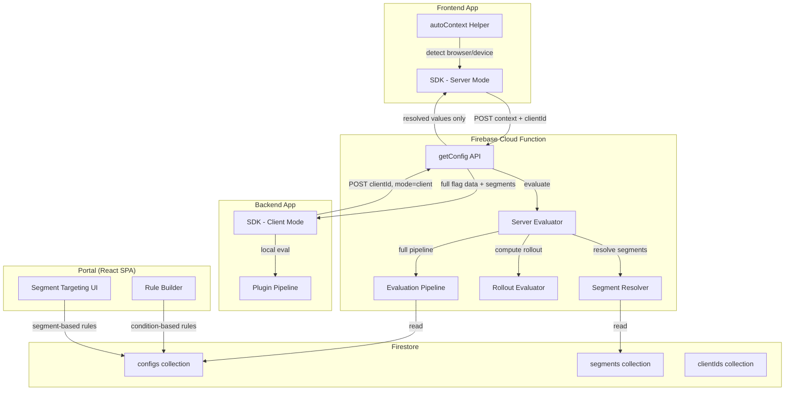
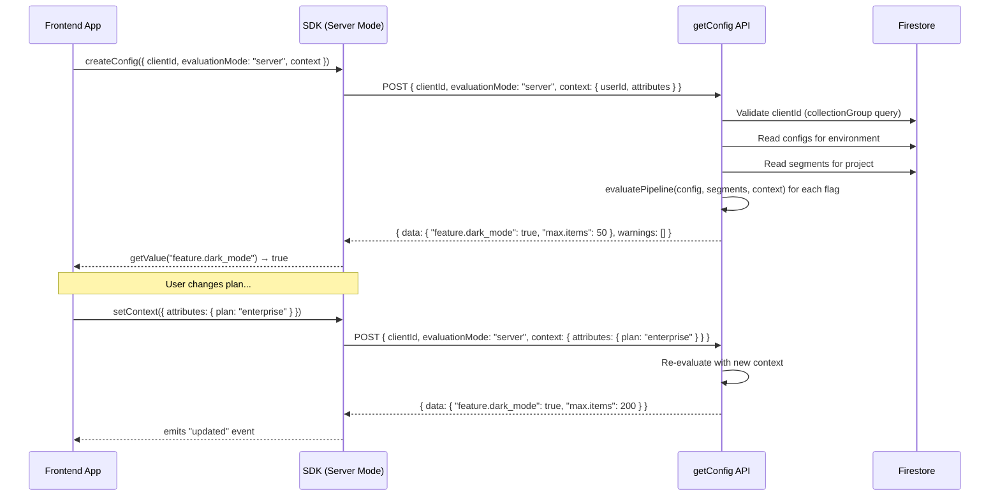
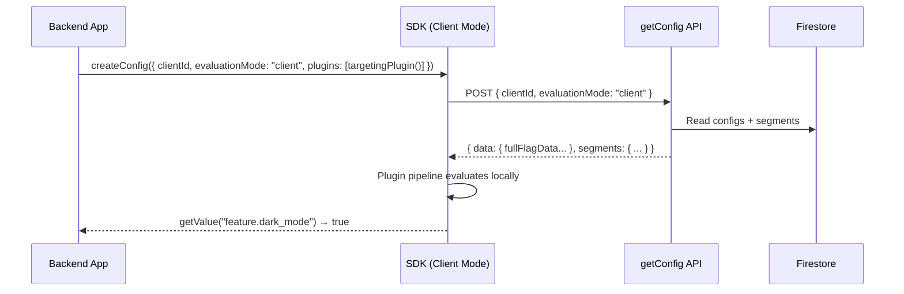

# Design Document: Server-Evaluated Config

## Overview

The server-evaluated config feature shifts the evaluation of targeting rules, segments, rollouts, and other advanced flag features from the browser SDK to the Cloud Function API. The SDK becomes a thin transport layer that sends user context and receives pre-resolved values. This eliminates client-side exposure of business logic, reduces payload size, and simplifies the SDK for frontend consumers.

The system supports two modes:

- **Server mode (default):** SDK sends user context → API evaluates everything → returns flat resolved values
- **Client mode (opt-in):** API returns full flag data + segments → SDK evaluates locally via plugin pipeline (current behavior)

The portal adds a simplified "segment targeting" UI that lets admins assign values directly to segments without manually building predicate conditions.

---

## Architecture



---

## Design Patterns

### 1. Strategy Pattern — Evaluation Mode

**Problem:** The API needs to return different response shapes based on whether the consumer wants server-evaluated results or raw flag data for local evaluation.

**Solution:** Two response strategies share the same data-fetching logic but diverge at the formatting/evaluation step.

```typescript
interface EvaluationStrategy {
  evaluate(
    configs: ConfigDoc[],
    segments: SegmentDoc[],
    context: UserContext | null,
  ): GetConfigResponse;
}

const serverStrategy: EvaluationStrategy = {
  evaluate(configs, segments, context) {
    const data: Record<string, unknown> = {};
    const warnings: Warning[] = [];
    for (const config of configs) {
      const resolved = evaluatePipeline(config, segments, context);
      data[config.key] = resolved.value;
      if (resolved.warning) warnings.push(resolved.warning);
    }
    return { data, warnings, version: "...", timestamp: "..." };
  },
};

const clientStrategy: EvaluationStrategy = {
  evaluate(configs, segments, _context) {
    // Return full flag data + segments (current behavior)
    const data = buildFullFlagData(configs);
    return { data, segments, version: "...", timestamp: "..." };
  },
};
```

### 2. Pipeline Pattern — Server-Side Evaluation

**Problem:** The API needs to replicate the SDK's multi-step evaluation pipeline (prerequisites → overrides → schedule → targeting → rollout) on the server.

**Solution:** Port the existing `PIPELINE_ORDER` and step logic to the server side. Each step is a pure function with the same interface, composed into a pipeline.

```typescript
// Server-side pipeline mirrors SDK pipeline order
const SERVER_PIPELINE: PipelineStep[] = [
  archivedStep,
  prerequisitesStep,
  overridesStep,
  scheduleStep,
  targetingStep,
  rolloutStep,
];

function evaluatePipeline(
  config: ConfigDoc,
  segments: SegmentDoc[],
  context: UserContext | null,
): { value: unknown; warning?: Warning } {
  for (const step of SERVER_PIPELINE) {
    const result = step.evaluate(config, segments, context);
    if (result.resolved) return { value: result.value };
  }
  return { value: config.value }; // Default value
}
```

### 3. Builder Pattern — Auto-Context

**Problem:** Frontend apps need a convenient way to populate common context attributes without manually detecting browser/device info.

**Solution:** An `autoContext()` builder that collects browser environment data and returns a standard `EvaluationContext` object.

```typescript
function autoContext(): EvaluationContext {
  return {
    attributes: {
      browser: detectBrowser(),
      browserVersion: detectBrowserVersion(),
      os: detectOS(),
      device: detectDevice(), // "desktop" | "mobile" | "tablet"
      screenWidth: window.screen.width,
      screenHeight: window.screen.height,
      locale: navigator.language,
      timezone: Intl.DateTimeFormat().resolvedOptions().timeZone,
    },
  };
}
```

### 4. Adapter Pattern — Dual-Mode Transport

**Problem:** The HTTP transport needs to include context in the request body for server mode but omit it for client mode.

**Solution:** The transport adapter conditionally includes context based on the configured evaluation mode.

```typescript
// Enhanced transport that conditionally sends context
interface EvaluatedTransportConfig extends TransportConfig {
  evaluationMode: "server" | "client";
  getContext: () => EvaluationContext;
}

const createEvaluatedTransport = (
  config: EvaluatedTransportConfig,
): HttpTransport => ({
  async request<T>(
    endpoint: string,
    body?: Record<string, unknown>,
  ): Promise<T> {
    const requestBody: Record<string, unknown> = {
      clientId: config.clientId,
      evaluationMode: config.evaluationMode,
      ...body,
    };
    if (config.evaluationMode === "server") {
      requestBody.context = config.getContext();
    }
    // ... fetch logic
  },
});
```

---

## Data Models

### API Request (Enhanced)

```typescript
interface GetConfigRequest {
  clientId: string;
  keys?: string[];
  evaluationMode?: "server" | "client"; // default: "server"
  context?: {
    userId?: string;
    attributes?: Record<string, string | number | boolean | string[]>;
  };
}
```

### API Response — Server Mode

```typescript
interface GetConfigResponseServer {
  data: Record<string, unknown>; // key → resolved value (flat)
  version: string;
  timestamp: string;
  warnings?: Array<{
    key: string;
    reason: "evaluation_error" | "segment_not_found" | "prerequisite_failed";
    message: string;
  }>;
}
```

### API Response — Client Mode (unchanged)

```typescript
interface GetConfigResponseClient {
  data: Record<string, unknown>; // key → full flag data or simple value
  segments: Record<string, Segment>;
  version: string;
  timestamp: string;
}
```

### Segment-Based Targeting Rule (Portal Storage)

A segment-based targeting rule is stored identically to a regular targeting rule, but with a special predicate structure:

```typescript
// Stored in Firestore as a normal TargetingRule
const segmentTargetingRule: TargetingRule = {
  id: "rule_abc123",
  priority: 1,
  value: true, // The value served to users in these segments
  conditions: [
    {
      predicates: [
        {
          attribute: "_segment",
          operator: "in_segment",
          value: ["segment_id_1", "segment_id_2"], // Array of segment IDs
        },
      ],
    },
  ],
};
```

The `_segment` attribute acts as a sentinel. During evaluation, when the evaluator encounters `attribute: "_segment"` with `operator: "in_segment"`, it checks if the user belongs to ANY of the listed segments (OR logic across the array).

### SDK CreateConfigOptions (Enhanced)

```typescript
interface CreateConfigOptions {
  clientId: string;
  evaluationMode?: "server" | "client"; // NEW — default: "server"
  loadingStrategy?: LoadingStrategy;
  fetchGranularity?: FetchGranularity;
  storage?: CacheStorage;
  retry?: RetryConfig;
  timeout?: number;
  baseUrl?: string;
  plugins?: EvaluationPlugin[]; // Only used in client mode
  context?: EvaluationContext;
  consentAware?: boolean;
}
```

---

## Components and Interfaces

### Cloud Function Changes

**File:** `functions/src/api/get-config.ts`

| Change                   | Description                                         |
| ------------------------ | --------------------------------------------------- |
| Parse `evaluationMode`   | Extract from request body, default to `"server"`    |
| Parse `context`          | Extract user context from request body              |
| Server evaluation branch | New code path that runs the evaluation pipeline     |
| Cache headers            | `private` for server mode, `public` for client mode |
| Warnings array           | Collect and return evaluation warnings              |

**New File:** `functions/src/api/server-evaluator.ts`

| Export                        | Description                                                             |
| ----------------------------- | ----------------------------------------------------------------------- |
| `evaluateConfigsForContext()` | Main entry: takes configs + segments + context, returns resolved values |
| `evaluateTargetingRules()`    | Evaluates targeting rules with segment resolution                       |
| `evaluateRollout()`           | Deterministic rollout bucketing using userId hash                       |
| `evaluateSchedule()`          | Checks if schedule is active based on current time                      |
| `evaluatePrerequisites()`     | Checks prerequisite flag dependencies                                   |

**New File:** `functions/src/api/rollout-hash.ts`

| Export                   | Description                                                |
| ------------------------ | ---------------------------------------------------------- |
| `computeRolloutBucket()` | Deterministic hash function (same as SDK's rollout plugin) |
| `isInRollout()`          | Given userId + flagKey + percentage, returns boolean       |

### SDK Changes

**File:** `packages/config/src/types.ts`

| Change                               | Description                            |
| ------------------------------------ | -------------------------------------- |
| `EvaluationMode` type                | New: `"server" \| "client"`            |
| `CreateConfigOptions.evaluationMode` | New optional field, default `"server"` |
| `GetConfigRequest.evaluationMode`    | Added to request interface             |
| `GetConfigRequest.context`           | Added context field                    |
| `GetConfigResponse.warnings`         | New optional warnings array            |

**File:** `packages/config/src/createConfig.ts`

| Change                 | Description                                         |
| ---------------------- | --------------------------------------------------- |
| Mode detection         | Skip plugin registration when mode is "server"      |
| Context passing        | Pass context getter to transport layer              |
| Re-fetch on setContext | Trigger refresh when context changes in server mode |

**New File:** `packages/config/src/context/autoContext.ts`

| Export           | Description                                           |
| ---------------- | ----------------------------------------------------- |
| `autoContext()`  | Detects browser, OS, device, screen, locale, timezone |
| `mergeContext()` | Deep-merges auto + user context (user wins)           |

**File:** `packages/config/src/transport/HttpTransport.ts`

| Change               | Description                                           |
| -------------------- | ----------------------------------------------------- |
| Context inclusion    | Include context in request body when mode is "server" |
| evaluationMode field | Include in every request                              |

**File:** `packages/config/src/client/ConfigClient.ts`

| Change                  | Description                                                       |
| ----------------------- | ----------------------------------------------------------------- |
| `setContext()` behavior | In server mode: update context + trigger re-fetch                 |
| Plugin skip             | In server mode: `getValue` returns raw cached value (no pipeline) |

### Portal Changes

**File:** `apps/portal/src/components/rule-builder.tsx`

| Change                 | Description                                                       |
| ---------------------- | ----------------------------------------------------------------- |
| Segment targeting mode | New "Segment" rule type alongside condition-based rules           |
| Segment picker UI      | Multi-select dropdown of available segments                       |
| Simplified display     | Show segment names as badges rather than raw predicate form       |
| Mixed rules            | Support both segment-based and condition-based rules in same list |

**New Component:** `apps/portal/src/components/segment-targeting-rule.tsx`

| Feature              | Description                                                |
| -------------------- | ---------------------------------------------------------- |
| Segment multi-select | Dropdown populated from project segments                   |
| Value input          | The value to serve when user is in selected segments       |
| Visual display       | Segment badges + arrow + value badge                       |
| Conversion           | Stores as standard TargetingRule with `_segment` predicate |

---

## Server-Side Evaluation Pipeline

The API replicates the SDK's evaluation pipeline. Steps execute in order; first resolved value wins.

```
┌─────────────────────────────────────────────────────────┐
│                    Evaluation Pipeline                    │
├──────────────┬──────────────────────────────────────────┤
│ Step 1       │ Archived Check                            │
│              │ If lifecycleState === "archived" → skip   │
├──────────────┼──────────────────────────────────────────┤
│ Step 2       │ Prerequisites                             │
│              │ Check all required flags are satisfied     │
├──────────────┼──────────────────────────────────────────┤
│ Step 3       │ User Overrides                            │
│              │ If userId in overrides map → return value │
├──────────────┼──────────────────────────────────────────┤
│ Step 4       │ Schedule                                  │
│              │ If activateAt <= now → return targetValue │
├──────────────┼──────────────────────────────────────────┤
│ Step 5       │ Targeting Rules                           │
│              │ Evaluate rules by priority with segments  │
├──────────────┼──────────────────────────────────────────┤
│ Step 6       │ Rollout                                   │
│              │ Hash(userId + flagKey) % 100 < percentage │
├──────────────┼──────────────────────────────────────────┤
│ Default      │ Return config.value (base value)          │
└──────────────┴──────────────────────────────────────────┘
```

### Segment Resolution within Targeting

When a targeting rule contains `in_segment` predicates:

1. Load the referenced segment's conditions
2. Evaluate segment conditions against user context attributes
3. For `attribute: "_segment"` with value as array: check if user is in ANY listed segment (OR logic)
4. If segment not found: predicate evaluates to `false`

### Rollout Hashing

Uses the same deterministic hash as the client-side rollout plugin:

```typescript
function computeRolloutBucket(userId: string, flagKey: string): number {
  const input = `${flagKey}:${userId}`;
  // Simple but consistent hash → number between 0-99
  let hash = 0;
  for (let i = 0; i < input.length; i++) {
    const char = input.charCodeAt(i);
    hash = ((hash << 5) - hash + char) | 0;
  }
  return Math.abs(hash) % 100;
}
```

---

## Data Flow

### Server Evaluation Flow



### Client Evaluation Flow (unchanged)



---

## TypeScript Interfaces

```typescript
// ═══════════════════════════════════════════════════════════════
// API Types
// ═══════════════════════════════════════════════════════════════

export type EvaluationMode = "server" | "client";

export interface GetConfigRequest {
  clientId: string;
  keys?: string[];
  evaluationMode?: EvaluationMode; // default: "server"
  context?: UserContext;
}

export interface UserContext {
  userId?: string;
  attributes?: Record<string, string | number | boolean | string[]>;
}

export interface EvaluationWarning {
  key: string;
  reason: "evaluation_error" | "segment_not_found" | "prerequisite_failed";
  message: string;
}

export interface GetConfigResponseServer {
  data: Record<string, unknown>;
  version: string;
  timestamp: string;
  warnings?: EvaluationWarning[];
}

export interface GetConfigResponseClient {
  data: Record<string, unknown>;
  segments: Record<string, unknown>;
  version: string;
  timestamp: string;
}

// ═══════════════════════════════════════════════════════════════
// Server Evaluator Types
// ═══════════════════════════════════════════════════════════════

export interface PipelineStepResult {
  resolved: boolean;
  value?: unknown;
  warning?: EvaluationWarning;
}

export interface ServerPipelineStep {
  stepId: string;
  evaluate(
    config: ConfigDoc,
    segments: Record<string, SegmentDoc>,
    context: UserContext | null,
    helpers: ServerPipelineHelpers,
  ): PipelineStepResult;
}

export interface ServerPipelineHelpers {
  evaluateFlag(key: string): unknown;
  now(): number;
}

// ═══════════════════════════════════════════════════════════════
// SDK Types (Enhanced)
// ═══════════════════════════════════════════════════════════════

export interface CreateConfigOptions {
  clientId: string;
  evaluationMode?: EvaluationMode; // NEW — default: "server"
  loadingStrategy?: LoadingStrategy;
  fetchGranularity?: FetchGranularity;
  storage?: CacheStorage;
  retry?: RetryConfig;
  timeout?: number;
  baseUrl?: string;
  plugins?: EvaluationPlugin[];
  context?: EvaluationContext;
  consentAware?: boolean;
}

// ═══════════════════════════════════════════════════════════════
// Auto-Context Types
// ═══════════════════════════════════════════════════════════════

export interface AutoContextAttributes {
  browser: string;
  browserVersion: string;
  os: string;
  device: "desktop" | "mobile" | "tablet";
  screenWidth: number;
  screenHeight: number;
  locale: string;
  timezone: string;
}

// ═══════════════════════════════════════════════════════════════
// Portal Types (Segment Targeting)
// ═══════════════════════════════════════════════════════════════

/** A segment-based targeting rule for simplified UI display */
export interface SegmentTargetingRule {
  id: string;
  priority: number;
  value: unknown;
  segmentIds: string[]; // UI-level representation
}

/** Converts to standard TargetingRule with _segment predicate for storage */
export function toStorageRule(rule: SegmentTargetingRule): TargetingRule {
  return {
    id: rule.id,
    priority: rule.priority,
    value: rule.value,
    conditions: [
      {
        predicates: [
          {
            attribute: "_segment",
            operator: "in_segment",
            value: rule.segmentIds,
          },
        ],
      },
    ],
  };
}

/** Detects if a stored rule is a segment-based rule */
export function isSegmentRule(rule: TargetingRule): boolean {
  return (
    rule.conditions.length === 1 &&
    rule.conditions[0].predicates.length === 1 &&
    rule.conditions[0].predicates[0].attribute === "_segment" &&
    rule.conditions[0].predicates[0].operator === "in_segment"
  );
}
```

---

## Error Handling

| Scenario                                 | Handling                                                                             |
| ---------------------------------------- | ------------------------------------------------------------------------------------ |
| **Invalid context shape**                | API validates context structure, returns 400 with descriptive error if malformed     |
| **Segment not found during evaluation**  | Predicate evaluates to `false`, adds warning to response, continues with other flags |
| **Targeting rule evaluation error**      | Catches exception, returns default value for that flag, adds warning                 |
| **Prerequisite flag missing**            | Treats as unsatisfied prerequisite, skips to default value                           |
| **Rollout without userId**               | Skips rollout step, falls through to default value                                   |
| **Network failure (SDK)**                | Falls back to cache (existing behavior), emits `fetchError` event                    |
| **setContext triggers re-fetch failure** | Keeps previous cached values, emits `fetchError` event, does not throw               |
| **Empty context in server mode**         | All targeting-dependent flags return defaults (as if no attributes match)            |

---

## Security Considerations

| Concern                          | Mitigation                                                                              |
| -------------------------------- | --------------------------------------------------------------------------------------- |
| **Business logic exposure**      | Server mode never sends targeting rules, segments, or rollout config to client          |
| **Context injection**            | API only uses context for evaluation, never persists or logs user attributes            |
| **Oversized context payload**    | API rejects context objects > 10KB with 413 status                                      |
| **Client mode segment exposure** | Acceptable for backend use — segments don't contain secrets, only predicate definitions |

---

## Performance Impact

| Aspect                | Server Mode                   | Client Mode                        |
| --------------------- | ----------------------------- | ---------------------------------- |
| Response payload size | ~200 bytes (just values)      | ~5-50KB (full flags + segments)    |
| API computation       | Higher (evaluates pipeline)   | Lower (just reads + returns)       |
| CDN cacheability      | No (varies by context)        | Yes (same for all consumers)       |
| SDK bundle size       | Smaller (no plugins needed)   | Larger (targeting/rollout plugins) |
| Re-evaluation cost    | Network round-trip            | Instant (local)                    |
| Appropriate for       | Frontend apps, low flag count | Backend services, frequent re-eval |

---

## Migration Path

The change is backward-compatible:

1. **Existing SDK consumers** (no `evaluationMode` specified) will default to `"server"` mode — but since they likely don't pass context, they'll get default values for targeting-dependent flags. This is correct: without context, no targeting can be applied.
2. **Existing backend consumers** explicitly using plugins should set `evaluationMode: "client"` to preserve current behavior.
3. The API detects mode from the request and returns the appropriate response shape.
4. No database schema changes are required — segment-based rules use the existing `TargetingRule` structure with a special `_segment` attribute.
