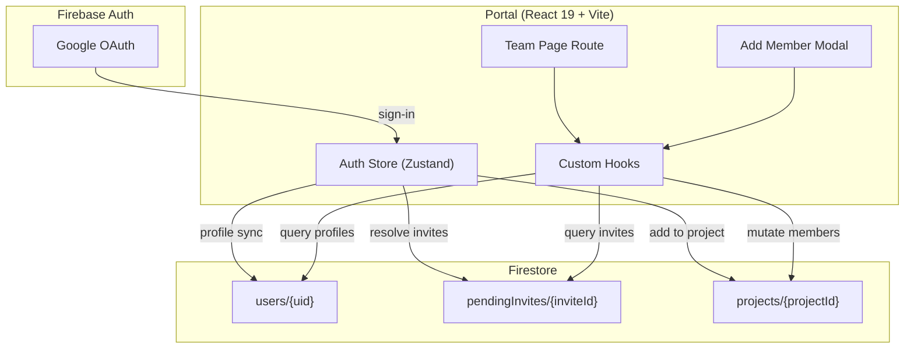
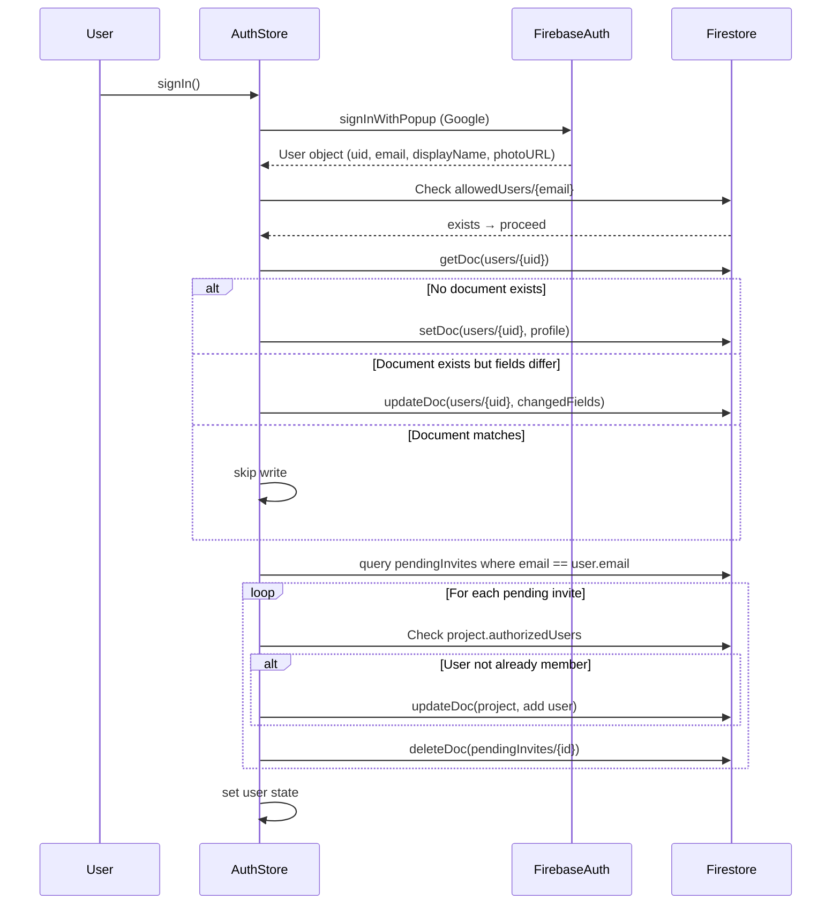

# Design Document: Team Member Management

## Overview

This design transforms the existing team management page from a raw-UID-based system into a user-friendly, email-driven workflow with profile display, pending invites, and immutable email protection via Firestore rules.

**Key design decisions:**
- All logic remains client-side (no Cloud Functions) — profile sync, invite resolution, and member mutations happen in the browser
- A `users/{uid}` collection stores profile data; email is immutable after creation
- A `pendingInvites/{inviteId}` collection holds invites for users who haven't signed in yet
- The auth store handles profile sync on every sign-in and resolves pending invites
- Firestore Security Rules enforce email immutability and invite access control

## Architecture



### Data Flow: Sign-In with Profile Sync & Invite Resolution



## Components and Interfaces

### Auth Store Extensions

The existing `useAuthStore` is extended with profile sync and invite resolution logic:

```typescript
// Profile sync function (called during onAuthStateChanged)
async function syncUserProfile(firebaseUser: User): Promise<void>

// Invite resolution function (called after profile sync)
async function resolveInvites(firebaseUser: User): Promise<void>
```

### New Hooks

| Hook | Purpose | Returns |
|------|---------|---------|
| `useUserProfiles(uids: string[])` | Batch-fetch user profiles for a list of UIDs | `{ data: Record<string, UserProfile>, isLoading }` |
| `useSearchUserByEmail(email: string)` | Search for a user profile by email | `{ data: UserProfile \| null, isLoading }` |
| `usePendingInvites(projectId: string)` | Fetch pending invites for a project | `{ data: PendingInvite[], isLoading }` |
| `useInviteResolver()` | Exposed for manual re-trigger if needed | `{ resolve: () => Promise<void> }` |

### New Components

| Component | Purpose |
|-----------|---------|
| `AddMemberModal` | ResponsiveModal for email search → add/invite flow |
| `MemberCard` | Displays member avatar, name, role badge, remove button |
| `PendingInviteCard` | Displays pending invite email, role, cancel button |
| `UserAvatar` | Avatar with fallback initials |

### Modified Components

| Component | Changes |
|-----------|---------|
| `RBACManager` → replaced by new Team page | Full rewrite of team list using profiles |
| `team.tsx` route | Uses new hooks and components |

## Data Models

### UserProfile (`users/{uid}`)

```typescript
interface UserProfile {
  uid: string;           // non-empty, matches document ID
  displayName: string | null;
  email: string;         // non-empty, stored lowercase, immutable after creation
  photoURL: string | null;
}
```

### PendingInvite (`pendingInvites/{inviteId}`)

```typescript
interface PendingInvite {
  email: string;         // lowercase, the invited user's email
  projectId: string;     // reference to the project
  role: RBACRole;        // "viewer" | "editor" | "admin"
  invitedBy: string;     // uid of the admin who sent the invite
  createdAt: string;     // ISO timestamp
}
```

### Project (existing, unchanged)

```typescript
interface Project {
  // ... existing fields ...
  authorizedUsers: string[];           // array of user UIDs
  roles: Record<string, RBACRole>;     // uid → role mapping
}
```

### Profile Sync Logic (Pure Function)

```typescript
interface ProfileSyncResult {
  action: "create" | "update" | "skip";
  payload?: Partial<UserProfile>;
}

function computeProfileSync(
  authUser: { uid: string; displayName: string | null; email: string | null; photoURL: string | null },
  existingDoc: UserProfile | null
): ProfileSyncResult
```

**Rules:**
- If `existingDoc` is null → action: "create", payload is full profile with `email.toLowerCase()`
- If `existingDoc` exists and `displayName` + `photoURL` match → action: "skip"
- If `existingDoc` exists and fields differ → action: "update", payload contains only changed `displayName`/`photoURL` (never `email`)

### Invite Resolution Logic (Pure Function)

```typescript
interface InviteResolutionAction {
  invite: PendingInvite;
  action: "add_and_delete" | "delete_only";
}

function computeInviteResolutions(
  userUid: string,
  invites: PendingInvite[],
  projectMemberships: Record<string, string[]> // projectId → authorizedUsers
): InviteResolutionAction[]
```

**Rules:**
- For each invite: if `userUid` is NOT in `projectMemberships[invite.projectId]` → "add_and_delete"
- If `userUid` IS already a member → "delete_only" (no re-add)

### Initials Extraction (Pure Function)

```typescript
function getInitials(displayName: string | null): string
```

**Rules:**
- If null or empty → return "?"
- Split by whitespace, take first character of first and last parts
- Return uppercase, max 2 characters

## Correctness Properties

*A property is a characteristic or behavior that should hold true across all valid executions of a system — essentially, a formal statement about what the system should do. Properties serve as the bridge between human-readable specifications and machine-verifiable correctness guarantees.*

### Property 1: Profile document creation produces valid schema with lowercase email

*For any* Firebase Auth user with a non-null email, `computeProfileSync(authUser, null)` SHALL return action "create" with a payload containing: uid (matching authUser.uid), displayName (matching authUser.displayName), email (equal to authUser.email.toLowerCase()), and photoURL (matching authUser.photoURL).

**Validates: Requirements 1.1, 1.4**

### Property 2: Profile diff logic — skip when matching, selective non-email update otherwise

*For any* (authUser, existingDoc) pair, `computeProfileSync` SHALL return "skip" when displayName and photoURL both match the existing document; otherwise it SHALL return "update" with a payload containing only the fields that differ, and the payload SHALL never include the "email" key.

**Validates: Requirements 1.2, 1.3**

### Property 3: Email search normalizes input to lowercase

*For any* email string with arbitrary casing, the search function SHALL normalize it to lowercase before querying, such that searching for "Foo@Bar.COM" is equivalent to searching for "foo@bar.com".

**Validates: Requirements 2.2**

### Property 4: Add member state transition

*For any* valid project state and new member (uid, role) where uid is not already in authorizedUsers, after the add-member operation, the resulting authorizedUsers SHALL contain the uid and roles[uid] SHALL equal the selected role.

**Validates: Requirements 3.1**

### Property 5: Invite document creation schema

*For any* (email, projectId, role, invitedBy) tuple where all are non-empty strings, the created invite document SHALL contain all five fields (email lowercase, projectId, role, invitedBy, createdAt) with createdAt being a valid ISO timestamp.

**Validates: Requirements 4.1**

### Property 6: Invite resolution adds user and deletes invite

*For any* (user, pendingInvite, projectState) tuple, `computeInviteResolutions` SHALL return "add_and_delete" when the user is not already a member of the invite's project, and "delete_only" when the user is already a member. In both cases, the invite SHALL be marked for deletion.

**Validates: Requirements 4.2, 4.3**

### Property 7: Member removal state transition

*For any* valid project state with multiple admins and a member to remove, after the remove operation, the resulting authorizedUsers SHALL NOT contain the removed uid and roles SHALL NOT have a key for the removed uid.

**Validates: Requirements 5.2**

### Property 8: Initials extraction

*For any* non-null, non-empty displayName string, `getInitials` SHALL return a 1-2 character uppercase string derived from the first character of the first word and the first character of the last word. For null or empty input, it SHALL return "?".

**Validates: Requirements 6.2**

## Error Handling

| Scenario | Handling |
|----------|----------|
| Profile sync fails (network/permissions) | Log error, continue sign-in — user is not blocked (Req 1.5) |
| Invite resolution fails for one invite | Log error, continue resolving remaining invites, don't block sign-in |
| Email search fails | Show error toast, allow retry |
| Add member fails (Firestore write) | Show error toast, modal stays open for retry |
| Remove member fails | Show error toast, confirmation closes |
| Last-admin removal attempted | Prevent action client-side, show validation message |
| Duplicate invite attempted | Show validation message — no Firestore write |
| Already-a-member add attempted | Show validation message — no Firestore write |

**Optimistic updates**: Member addition/removal mutations use TanStack Query's `onMutate` for optimistic UI, with rollback on error.

## Testing Strategy

### Unit Tests (Example-Based)

- Auth store profile sync: test error handling path (write fails, sign-in proceeds)
- Modal UI states: empty, found user, not found, loading
- Confirmation dialog before removal
- Validation messages: duplicate member, duplicate invite, last admin
- Fallback rendering: no photoURL → initials, no profile → raw uid

### Property-Based Tests (fast-check)

The project uses TypeScript with Vitest. Property tests will use [fast-check](https://github.com/dubzzz/fast-check) with minimum 100 iterations per property.

Each property test references its design document property:

- **Feature: team-member-management, Property 1**: Profile creation schema + lowercase email
- **Feature: team-member-management, Property 2**: Profile diff logic (skip vs selective update)
- **Feature: team-member-management, Property 3**: Email normalization to lowercase
- **Feature: team-member-management, Property 4**: Add member state transition
- **Feature: team-member-management, Property 5**: Invite document creation schema
- **Feature: team-member-management, Property 6**: Invite resolution logic
- **Feature: team-member-management, Property 7**: Member removal state transition
- **Feature: team-member-management, Property 8**: Initials extraction

### Integration Tests (Firebase Emulator)

Firestore Security Rules tests using the Firebase emulator:
- `users/{uid}` create: matching uid + email required
- `users/{uid}` update: email immutable
- `users/{uid}` delete: denied
- `users/{uid}` read: any authenticated user
- `pendingInvites` create: admin only
- `pendingInvites` delete: admin only
- `pendingInvites` read: email-matching user only
- `pendingInvites` update: always denied

### Firestore Security Rules (New)

```
// Users collection — profile storage
match /users/{userId} {
  allow read: if request.auth != null;
  allow create: if request.auth != null
    && request.auth.uid == userId
    && request.resource.data.email == request.auth.token.email;
  allow update: if request.auth != null
    && request.auth.uid == userId
    && request.resource.data.email == resource.data.email;
  allow delete: if false;
}

// Pending invites collection
match /pendingInvites/{inviteId} {
  allow read: if request.auth != null
    && resource.data.email == request.auth.token.email.lower();
  allow create: if request.auth != null
    && hasRole(request.resource.data.projectId, 'admin');
  allow delete: if request.auth != null
    && hasRole(resource.data.projectId, 'admin');
  allow update: if false;
}
```
