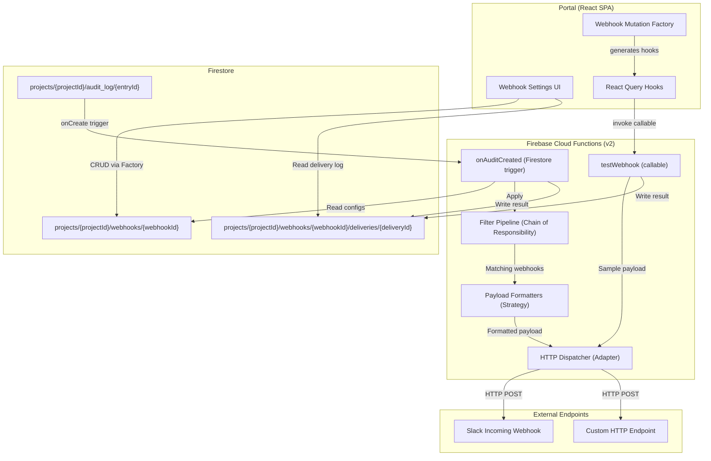
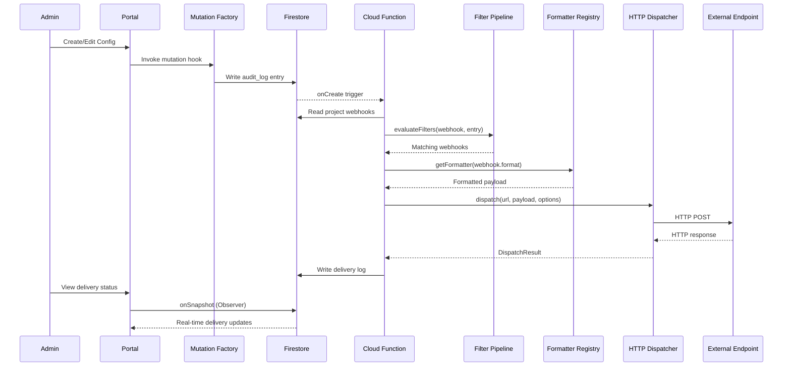

# Design Document: Webhook Notifications

## Overview

The webhook notifications feature enables project admins to receive real-time HTTP callbacks when configuration changes occur within their projects. The system uses a **Firebase Cloud Functions trigger** on Firestore `audit_log` writes as the event source, eliminating the need for a custom server or message queue.

When any mutation in the portal writes an audit log entry, a Cloud Function fires, reads the project's webhook configurations, evaluates filter criteria through a composable filter pipeline, and dispatches HTTP POST requests to matching endpoints via a pluggable dispatcher. Payload formatting is handled by strategy-based formatters, making it trivial to add new output formats. Delivery results are logged per-webhook for observability. The portal provides a settings UI for CRUD operations on webhook configurations (built with a mutation factory pattern), format selection, and delivery history viewing.

---

## Architecture



---

## Design Patterns

The Cloud Function and portal leverage five design patterns to keep the system extensible, testable, and maintainable.

### 1. Strategy Pattern — Payload Formatters

**Problem:** Formatting logic for different targets (standard JSON, Slack Block Kit) would require if/else branching that grows with each new format.

**Solution:** Each formatter implements a common `PayloadFormatter` interface. A registry maps format names to implementations, making the system open for extension without modifying dispatch logic.

```typescript
// Strategy interface
interface PayloadFormatter {
  format(entry: AuditEntry, webhook: WebhookConfig, projectId: string): unknown;
  contentType: string;
}

// Concrete strategies
const standardFormatter: PayloadFormatter = {
  contentType: "application/json",
  format(entry, webhook, projectId) {
    return {
      action: entry.action,
      resourceCategory: getResourceCategory(entry.resourcePath),
      resourcePath: entry.resourcePath,
      resourceName: formatResourceName(entry.resourcePath),
      environment: getEnvironmentFromPath(entry.resourcePath),
      actorId: entry.actorId,
      timestamp: entry.timestamp,
      oldValue: entry.oldValue ?? null,
      newValue: entry.newValue ?? null,
      projectId,
      webhookId: webhook.id,
    };
  },
};

const slackFormatter: PayloadFormatter = {
  contentType: "application/json",
  format(entry, webhook, projectId) {
    // Returns Slack Block Kit structure
    return { blocks: [...] };
  },
};

// Open registry — add new formatters without touching existing code
const formatterRegistry: Record<string, PayloadFormatter> = {
  standard: standardFormatter,
  slack: slackFormatter,
};

// Usage in dispatch
function getFormatter(format: string): PayloadFormatter {
  const formatter = formatterRegistry[format];
  if (!formatter) throw new Error(`Unknown format: ${format}`);
  return formatter;
}
```

**Benefit:** Adding Discord, Microsoft Teams, or PagerDuty formatters requires only a new strategy and a registry entry — zero changes to existing code.

### 2. Chain of Responsibility — Filter Pipeline

**Problem:** A monolithic `evaluateFilters` function with nested if-statements becomes hard to test, extend, and reason about as filter criteria grow.

**Solution:** Each filter is an independent, composable function. The pipeline evaluates filters in sequence — if any filter rejects, the webhook is skipped. New filters (e.g., actor-based, time-window) can be inserted without modifying existing ones.

```typescript
// Each filter is a standalone, testable function
type FilterFn = (webhook: WebhookConfig, entry: AuditEntry) => boolean;

const eventTypeFilter: FilterFn = (webhook, entry) => {
  if (webhook.eventTypes.length === 0) return true;
  return webhook.eventTypes.includes(entry.action);
};

const resourceCategoryFilter: FilterFn = (webhook, entry) => {
  if (webhook.resourceCategories.length === 0) return true;
  const category = getResourceCategory(entry.resourcePath);
  return webhook.resourceCategories.includes(category);
};

const environmentFilter: FilterFn = (webhook, entry) => {
  if (webhook.environments.length === 0) return true;
  const env = getEnvironmentFromPath(entry.resourcePath);
  if (env === null) return true; // No env segment = matches all
  return webhook.environments.includes(env);
};

// Pipeline composition — open for extension
const filterPipeline: FilterFn[] = [
  eventTypeFilter,
  resourceCategoryFilter,
  environmentFilter,
];

// Evaluation: short-circuits on first rejection
function evaluateFilters(webhook: WebhookConfig, entry: AuditEntry): boolean {
  return filterPipeline.every((filter) => filter(webhook, entry));
}
```

**Benefit:** Each filter is independently unit-testable. Adding new filters (e.g., actor filter, time-of-day filter) is a one-line addition to the pipeline array.

### 3. Factory Pattern — Webhook Mutation Factory

**Problem:** Each CRUD hook (create, update, delete, toggle) requires the same boilerplate: auth checks, audit logging, Firestore writes, query invalidation, and toast feedback.

**Solution:** A `createWebhookMutation` factory (modeled after the existing `createConfigFieldMutation` pattern) generates mutation hooks with consistent behavior, reducing duplication across 5+ hooks.

```typescript
// Factory following the existing createConfigFieldMutation pattern
function createWebhookMutation<TParams>(options: {
  mutationFn: (
    params: TParams,
    projectId: string,
    userId: string,
  ) => Promise<unknown>;
  invalidateKeys: (projectId: string) => string[][];
  toastSuccess: string;
  toastError?: string;
}) {
  return () => {
    const queryClient = useQueryClient();
    const user = useAuthStore((s) => s.user);

    return useMutation({
      mutationFn: async (params: TParams & { projectId: string }) => {
        if (!user) throw new Error("Not authenticated");
        return options.mutationFn(params, params.projectId, user.uid);
      },
      onSuccess: (_data, variables) => {
        options
          .invalidateKeys(variables.projectId)
          .forEach((key) => queryClient.invalidateQueries({ queryKey: key }));
        toast.success(options.toastSuccess);
      },
      onError: (error) => {
        toast.error(options.toastError ?? error.message);
      },
    });
  };
}

// Usage — each hook is just a factory call
export const useCreateWebhook = createWebhookMutation<CreateWebhookParams>({
  mutationFn: async (params, projectId, userId) => {
    /* Firestore write */
  },
  invalidateKeys: (pid) => [["webhooks", pid]],
  toastSuccess: "Webhook created",
});

export const useToggleWebhook = createWebhookMutation<ToggleWebhookParams>({
  mutationFn: async (params, projectId) => {
    /* toggle enabled */
  },
  invalidateKeys: (pid) => [["webhooks", pid]],
  toastSuccess: "Webhook updated",
});
```

**Benefit:** Eliminates ~60% of repeated mutation boilerplate. Ensures consistent error handling and UX feedback across all webhook operations.

### 4. Observer Pattern — Delivery Status (Firestore onSnapshot)

**Problem:** The portal needs real-time updates when deliveries succeed or fail, without polling.

**Solution:** The `useWebhookDeliveries` hook subscribes to Firestore's real-time `onSnapshot` listener. When the Cloud Function writes a delivery log entry, the portal receives the update immediately via Firestore's built-in observer mechanism.

```typescript
// Observer via Firestore real-time subscription
function useWebhookDeliveries(projectId: string, webhookId: string) {
  return useQuery({
    queryKey: ["webhook-deliveries", projectId, webhookId],
    queryFn: () =>
      new Promise((resolve) => {
        const ref = collection(
          db,
          "projects",
          projectId,
          "webhooks",
          webhookId,
          "deliveries",
        );
        const q = query(ref, orderBy("timestamp", "desc"));
        return onSnapshot(q, (snapshot) => {
          resolve(snapshot.docs.map((doc) => ({ id: doc.id, ...doc.data() })));
        });
      }),
  });
}
```

**Benefit:** Zero-latency UI updates. No polling overhead. Leverages Firestore's native real-time capabilities.

### 5. Adapter Pattern — HTTP Dispatcher

**Problem:** The dispatch mechanism is tightly coupled to `fetch`, making it hard to test, mock, or swap for a queue-based approach later.

**Solution:** Define a `WebhookDispatcher` interface that the Cloud Function codes against. The default implementation uses `fetch`, but tests can inject a mock dispatcher, and a future refactor could swap in a queue-based dispatcher (e.g., Cloud Tasks) with zero changes to the calling code.

```typescript
// Adapter interface
interface DispatchOptions {
  timeout: number;
  headers: Record<string, string>;
}

interface DispatchResult {
  success: boolean;
  httpStatus: number | null;
  duration: number;
  error: string | null;
}

interface WebhookDispatcher {
  dispatch(
    url: string,
    payload: unknown,
    options: DispatchOptions,
  ): Promise<DispatchResult>;
}

// Default HTTP implementation
const httpDispatcher: WebhookDispatcher = {
  async dispatch(url, payload, options) {
    const controller = new AbortController();
    const timer = setTimeout(() => controller.abort(), options.timeout);
    const start = Date.now();

    try {
      const response = await fetch(url, {
        method: "POST",
        headers: { "Content-Type": "application/json", ...options.headers },
        body: JSON.stringify(payload),
        signal: controller.signal,
      });
      return {
        success: response.ok,
        httpStatus: response.status,
        duration: Date.now() - start,
        error: response.ok ? null : `HTTP ${response.status}`,
      };
    } catch (err) {
      return {
        success: false,
        httpStatus: null,
        duration: Date.now() - start,
        error: err instanceof Error ? err.message : "Unknown error",
      };
    } finally {
      clearTimeout(timer);
    }
  },
};

// Future: queue-based dispatcher for high-volume projects
// const queueDispatcher: WebhookDispatcher = { ... }
```

**Benefit:** Fully testable without network calls. Future-proofed for architectural upgrades (queues, retries) without touching dispatch consumers.

---

## Data Models

### Webhook Configuration

**Path:** `projects/{projectId}/webhooks/{webhookId}`

| Field                | Type       | Description                                                                                |
| -------------------- | ---------- | ------------------------------------------------------------------------------------------ |
| `name`               | `string`   | Human-readable label (e.g., "Slack #deploys")                                              |
| `url`                | `string`   | HTTPS endpoint URL                                                                         |
| `enabled`            | `boolean`  | Whether the webhook is active (default: `true`)                                            |
| `eventTypes`         | `string[]` | Filter: `["create", "update", "delete", "state_change"]`. Empty = all.                     |
| `resourceCategories` | `string[]` | Filter: `["config", "segment", "api_key", "project", "team", "environment"]`. Empty = all. |
| `environments`       | `string[]` | Filter: environment names (e.g., `["production"]`). Empty = all.                           |
| `format`             | `string`   | `"standard"` or `"slack"` (extensible via formatter registry)                              |
| `createdAt`          | `string`   | ISO 8601 timestamp                                                                         |
| `updatedAt`          | `string`   | ISO 8601 timestamp                                                                         |

### Delivery Log

**Path:** `projects/{projectId}/webhooks/{webhookId}/deliveries/{deliveryId}`

| Field          | Type      | Description                                |
| -------------- | --------- | ------------------------------------------ |
| `timestamp`    | `string`  | ISO 8601 timestamp of the dispatch attempt |
| `httpStatus`   | `number   | null`                                      | Response status code, null if network failure |
| `success`      | `boolean` | `true` if HTTP 2xx received                |
| `duration`     | `number`  | Request duration in milliseconds           |
| `error`        | `string   | null`                                      | Error message if dispatch failed              |
| `auditEntryId` | `string`  | Reference to the triggering audit entry    |
| `isTest`       | `boolean` | Whether this was a test dispatch           |

---

## Components and Interfaces

### Cloud Function Module Structure

```
functions/src/
├── index.ts                         # Entry point — exports all functions
├── types.ts                         # Shared TypeScript interfaces
├── constants.ts                     # Limits and defaults
├── formatters/
│   ├── formatter.interface.ts       # PayloadFormatter interface (Strategy)
│   ├── standard.formatter.ts        # Standard JSON formatter
│   ├── slack.formatter.ts           # Slack Block Kit formatter
│   └── registry.ts                  # Formatter registry (open for extension)
├── filters/
│   ├── filter.interface.ts          # FilterFn type definition
│   ├── event-type.filter.ts         # Event type filter
│   ├── resource-category.filter.ts  # Resource category filter
│   ├── environment.filter.ts        # Environment filter
│   └── pipeline.ts                  # Filter pipeline composition
├── dispatcher/
│   ├── dispatcher.interface.ts      # WebhookDispatcher interface (Adapter)
│   └── http.dispatcher.ts           # Default fetch-based implementation
├── delivery/
│   └── write-delivery-log.ts        # Delivery writer + 20-entry cap
├── triggers/
│   └── on-audit-created.ts          # Firestore onCreate trigger
├── callables/
│   └── test-webhook.ts              # testWebhook callable function
└── utils/
    └── audit-utils.ts               # getResourceCategory, getEnvironmentFromPath
```

### Portal New Components

| Component            | Location                                  | Description                                                                                                                                                         |
| -------------------- | ----------------------------------------- | ------------------------------------------------------------------------------------------------------------------------------------------------------------------- |
| `WebhookSettings`    | `src/components/webhook-settings.tsx`     | Main section rendered within project settings. Lists all webhooks, handles empty state.                                                                             |
| `WebhookCard`        | `src/components/webhook-card.tsx`         | Displays one webhook config: name, masked URL, status toggle, filter chips, last delivery indicator, action buttons.                                                |
| `WebhookFormModal`   | `src/components/webhook-form-modal.tsx`   | Radix Dialog modal for creating/editing a webhook. Fields: name, URL, format select, event type checkboxes, resource category checkboxes, environment multi-select. |
| `WebhookDeliveryLog` | `src/components/webhook-delivery-log.tsx` | Expandable panel showing delivery history for a single webhook. Shows timestamp, status badge, duration, and error details.                                         |

### Portal Hooks (via Mutation Factory)

All mutation hooks are generated by `createWebhookMutation`, ensuring consistent auth, invalidation, and toast behavior:

| Hook                   | Location                              | Description                                                  |
| ---------------------- | ------------------------------------- | ------------------------------------------------------------ |
| `useWebhooks`          | `src/hooks/use-webhooks.ts`           | Firestore real-time `onSnapshot` for webhook list (Observer) |
| `useCreateWebhook`     | `src/hooks/use-webhook-mutations.ts`  | Factory-generated: adds a webhook config document            |
| `useUpdateWebhook`     | `src/hooks/use-webhook-mutations.ts`  | Factory-generated: updates an existing webhook config        |
| `useDeleteWebhook`     | `src/hooks/use-webhook-mutations.ts`  | Factory-generated: deletes webhook + delivery subcollection  |
| `useToggleWebhook`     | `src/hooks/use-webhook-mutations.ts`  | Factory-generated: toggles the `enabled` field               |
| `useTestWebhook`       | `src/hooks/use-test-webhook.ts`       | Invokes the `testWebhook` callable Cloud Function            |
| `useWebhookDeliveries` | `src/hooks/use-webhook-deliveries.ts` | Firestore onSnapshot for delivery subcollection (Observer)   |

---

## Cloud Function Design

### `onAuditCreated` — Firestore Trigger

**Trigger:** `onDocumentCreated("projects/{projectId}/audit_log/{entryId}")`

**Flow using design patterns:**

1. Extract `projectId` from the document path.
2. Read the audit entry data.
3. Query all enabled webhooks for the project.
4. **Filter Pipeline (Chain of Responsibility):** Run each webhook through `evaluateFilters()` — the composable pipeline of independent filter functions.
5. **Formatter Registry (Strategy):** For each matching webhook, look up its formatter from the registry and build the payload.
6. **HTTP Dispatcher (Adapter):** Dispatch all payloads concurrently via the injected dispatcher using `Promise.allSettled`.
7. Write delivery log entries for each result.
8. Enforce the 20-entry cap on each delivery subcollection.

```typescript
export const onAuditCreated = onDocumentCreated(
  "projects/{projectId}/audit_log/{entryId}",
  async (event) => {
    const { projectId } = event.params;
    const entry = event.data?.data() as AuditEntry;
    if (!entry) return;

    // 1. Get enabled webhooks
    const webhooks = await getEnabledWebhooks(projectId);

    // 2. Chain of Responsibility — filter pipeline
    const matching = webhooks.filter((wh) => evaluateFilters(wh, entry));
    if (matching.length === 0) return;

    // 3. Strategy — format payloads + Adapter — dispatch
    const results = await Promise.allSettled(
      matching.map(async (wh) => {
        const formatter = getFormatter(wh.format);
        const payload = formatter.format(entry, wh, projectId);
        return dispatcher.dispatch(wh.url, payload, {
          timeout: DISPATCH_TIMEOUT_MS,
          headers: {
            "Content-Type": formatter.contentType,
            "X-Webhook-Id": wh.id,
            "X-Webhook-Timestamp": String(Math.floor(Date.now() / 1000)),
          },
        });
      }),
    );

    // 4. Write delivery logs
    await Promise.all(
      results.map((result, i) =>
        writeDeliveryLog(projectId, matching[i].id, result, entry.id, false),
      ),
    );
  },
);
```

### `testWebhook` — Callable Function

**Type:** `onCall` (Firebase callable function)

**Input:** `{ projectId: string, webhookId: string }`

**Flow:**

1. Verify caller has admin role for the project.
2. Read the webhook configuration.
3. Use the formatter registry to build a sample payload with `test: true` flag.
4. Dispatch via the adapter interface with 10-second timeout.
5. Write delivery log entry with `isTest: true`.
6. Return `{ success: boolean, httpStatus: number | null, error: string | null }`.

### Payload Formats

**Standard format (via `standardFormatter`):**

```json
{
  "action": "update",
  "resourceCategory": "config",
  "resourcePath": "environments/production/configs/feature.enabled",
  "resourceName": "feature.enabled",
  "environment": "production",
  "actorId": "user_abc123",
  "timestamp": "2025-01-15T10:30:00.000Z",
  "oldValue": { "value": false, "valueType": "boolean" },
  "newValue": { "value": true, "valueType": "boolean" },
  "projectId": "proj_xyz",
  "webhookId": "wh_001"
}
```

**Slack Block Kit format (via `slackFormatter`):**

```json
{
  "blocks": [
    {
      "type": "header",
      "text": { "type": "plain_text", "text": "🔔 Config Updated" }
    },
    {
      "type": "section",
      "fields": [
        { "type": "mrkdwn", "text": "*Resource:*\nfeature.enabled" },
        { "type": "mrkdwn", "text": "*Environment:*\nproduction" }
      ]
    },
    {
      "type": "section",
      "fields": [
        { "type": "mrkdwn", "text": "*Action:*\nupdate" },
        { "type": "mrkdwn", "text": "*Actor:*\nuser_abc123" }
      ]
    },
    {
      "type": "section",
      "text": { "type": "mrkdwn", "text": "*Changes:*\n`false` → `true`" }
    },
    {
      "type": "context",
      "elements": [
        { "type": "mrkdwn", "text": "2025-01-15T10:30:00.000Z • proj_xyz" }
      ]
    }
  ]
}
```

### Delivery Logging with 20-Entry Cap

After writing a new delivery log entry, query the subcollection ordered by `timestamp` ascending. If count exceeds 20, delete the oldest entries in a batched write.

```typescript
async function enforceDeliveryCap(
  projectId: string,
  webhookId: string,
): Promise<void> {
  const deliveriesRef = collection(
    db,
    "projects",
    projectId,
    "webhooks",
    webhookId,
    "deliveries",
  );
  const snapshot = await getDocs(
    query(deliveriesRef, orderBy("timestamp", "asc")),
  );

  if (snapshot.size > 20) {
    const batch = writeBatch(db);
    const toDelete = snapshot.docs.slice(0, snapshot.size - 20);
    toDelete.forEach((doc) => batch.delete(doc.ref));
    await batch.commit();
  }
}
```

---

## TypeScript Interfaces

```typescript
/** Webhook configuration stored in Firestore */
export interface WebhookConfig {
  id: string;
  name: string;
  url: string;
  enabled: boolean;
  eventTypes: EventType[];
  resourceCategories: WebhookResourceCategory[];
  environments: string[];
  format: string; // Extensible — any key in formatterRegistry
  createdAt: string;
  updatedAt: string;
}

/** Supported event types for filtering */
export type EventType = "create" | "update" | "delete" | "state_change";

/** Resource categories for filtering */
export type WebhookResourceCategory =
  "config" | "segment" | "api_key" | "project" | "team" | "environment";

/** Delivery log entry for a single dispatch attempt */
export interface WebhookDelivery {
  id: string;
  timestamp: string;
  httpStatus: number | null;
  success: boolean;
  duration: number;
  error: string | null;
  auditEntryId: string;
  isTest: boolean;
}

/** Strategy interface for payload formatting */
export interface PayloadFormatter {
  format(entry: AuditEntry, webhook: WebhookConfig, projectId: string): unknown;
  contentType: string;
}

/** Adapter interface for HTTP dispatch */
export interface DispatchOptions {
  timeout: number;
  headers: Record<string, string>;
}

export interface DispatchResult {
  success: boolean;
  httpStatus: number | null;
  duration: number;
  error: string | null;
}

export interface WebhookDispatcher {
  dispatch(
    url: string,
    payload: unknown,
    options: DispatchOptions,
  ): Promise<DispatchResult>;
}

/** Chain of Responsibility — individual filter function type */
export type FilterFn = (webhook: WebhookConfig, entry: AuditEntry) => boolean;

/** Standard JSON payload sent to webhook endpoints */
export interface WebhookPayload {
  action: string;
  resourceCategory: string;
  resourcePath: string;
  resourceName: string;
  environment: string | null;
  actorId: string;
  timestamp: string;
  oldValue: unknown | null;
  newValue: unknown | null;
  projectId: string;
  webhookId: string;
  test?: boolean;
}

/** Slack Block Kit message structure */
export interface SlackBlockKitMessage {
  blocks: SlackBlock[];
}

export type SlackBlock =
  SlackHeaderBlock | SlackSectionBlock | SlackContextBlock;

export interface SlackHeaderBlock {
  type: "header";
  text: { type: "plain_text"; text: string };
}

export interface SlackSectionBlock {
  type: "section";
  text?: { type: "mrkdwn"; text: string };
  fields?: Array<{ type: "mrkdwn"; text: string }>;
}

export interface SlackContextBlock {
  type: "context";
  elements: Array<{ type: "mrkdwn"; text: string }>;
}
```

---

## Data Flow

1. **User creates webhook via Portal** → Factory-generated `useCreateWebhook` hook validates HTTPS URL, checks limit, writes to `projects/{projectId}/webhooks/{webhookId}`.

2. **Any mutation writes audit entry** → Existing portal code calls `writeAuditEntry()` → New document at `projects/{projectId}/audit_log/{entryId}`.

3. **Firestore trigger fires** → `onAuditCreated` Cloud Function activates → reads all enabled webhooks for the project.

4. **Filter Pipeline evaluates** → Chain of Responsibility: each filter function independently checks one criterion. Short-circuits on first rejection.

5. **Formatter Strategy builds payload** → Registry lookup by `webhook.format` → selected strategy formats the audit entry into the target shape.

6. **Dispatcher Adapter sends request** → `WebhookDispatcher.dispatch()` called with payload, timeout, and headers. Decoupled from transport implementation.

7. **Delivery result written** → Success/failure logged to `deliveries` subcollection. Oldest entries pruned if count exceeds 20.

8. **Portal observes delivery updates** → `useWebhookDeliveries` (Observer pattern via onSnapshot) receives real-time updates in the settings UI.



---

## Error Handling

| Scenario                          | Handling                                                                                                                                          |
| --------------------------------- | ------------------------------------------------------------------------------------------------------------------------------------------------- |
| **Network timeout**               | 10-second timeout via AbortController in `httpDispatcher`. Logs `success: false`, `error: "Request timed out"`, `httpStatus: null`. No retry.     |
| **Invalid URL at creation**       | Portal validates HTTPS protocol client-side via Zod schema in the form modal. Rejects non-HTTPS URLs before Firestore write.                      |
| **Non-2xx response**              | Dispatcher returns `DispatchResult` with actual `httpStatus` and error message. Logged to delivery subcollection. No retry.                       |
| **Max webhooks limit (10)**       | Factory-generated `useCreateWebhook` checks collection count before allowing creation. Displays error toast if limit reached.                     |
| **Unknown format in registry**    | `getFormatter()` throws descriptive error if `webhook.format` has no registered formatter. Logged as delivery failure.                            |
| **Delivery log rotation**         | After each write, `enforceDeliveryCap` queries subcollection count. If > 20, batch-deletes oldest entries.                                        |
| **Cloud Function cold start**     | Use Firebase v2 functions with `minInstances: 0`. Accept cold-start latency as acceptable for async notifications.                                |
| **Webhook URL unreachable**       | Caught by fetch timeout or DNS error in `httpDispatcher`. Logged as failed delivery. No circuit breaker (simple system).                          |
| **Concurrent audit writes**       | Each Cloud Function invocation is independent. Multiple triggers fire concurrently — safe since each reads webhooks and dispatches independently. |
| **Firestore quota / rate limits** | Cloud Function uses batched writes for delivery log cleanup. Webhook reads bounded by 10 max webhooks per project.                                |
| **Dispatcher injection failure**  | Default `httpDispatcher` is always available. Test environments inject mock dispatcher via dependency injection.                                  |

---

## Testing Strategy

The design patterns significantly improve testability by enabling isolated unit tests with injected mocks.

### Unit Tests (Cloud Functions)

| Test                                      | Pattern Tested          | Coverage                                                   |
| ----------------------------------------- | ----------------------- | ---------------------------------------------------------- |
| `eventTypeFilter` — empty array           | Chain of Responsibility | Verify empty eventTypes matches all entries                |
| `eventTypeFilter` — match                 | Chain of Responsibility | Verify correct filtering by action field                   |
| `eventTypeFilter` — mismatch              | Chain of Responsibility | Verify non-matching action is rejected                     |
| `resourceCategoryFilter` — match          | Chain of Responsibility | Verify `getResourceCategory` integration                   |
| `environmentFilter` — match               | Chain of Responsibility | Verify environment extraction and filter logic             |
| `environmentFilter` — no env in path      | Chain of Responsibility | Verify entries without environment pass all env filters    |
| `evaluateFilters` — pipeline composition  | Chain of Responsibility | Verify pipeline short-circuits correctly                   |
| `standardFormatter.format()`              | Strategy                | Verify correct JSON structure with all required fields     |
| `slackFormatter.format()`                 | Strategy                | Verify Slack Block Kit structure                           |
| `formatterRegistry` — unknown format      | Strategy                | Verify error thrown for unregistered format                |
| `httpDispatcher.dispatch()` — success     | Adapter                 | Verify correct fetch call and result parsing               |
| `httpDispatcher.dispatch()` — timeout     | Adapter                 | Verify AbortController fires and error is captured         |
| `httpDispatcher.dispatch()` — network err | Adapter                 | Verify graceful error handling for DNS/connection failures |
| `enforceDeliveryCap`                      | —                       | Verify oldest entries deleted when count exceeds 20        |

### Unit Tests (Portal)

| Test                                   | Pattern Tested | Coverage                                                    |
| -------------------------------------- | -------------- | ----------------------------------------------------------- |
| `createWebhookMutation` factory output | Factory        | Verify generated hooks have correct invalidation + toasts   |
| `WebhookFormModal` — URL validation    | —              | Verify HTTPS requirement and HTTP URL rejection             |
| `WebhookFormModal` — max limit         | —              | Verify error state when 10 webhooks exist                   |
| `WebhookCard` — status display         | —              | Verify rendering of enabled/disabled state and filter chips |
| `WebhookDeliveryLog` — ordering        | Observer       | Verify entries display in descending timestamp order        |

### Integration Tests

| Test                               | Coverage                                                                     |
| ---------------------------------- | ---------------------------------------------------------------------------- |
| Trigger → Pipeline → Dispatch flow | Write audit entry to emulator, verify filter pipeline + dispatcher fires     |
| Filter combination (pipeline)      | Write entries with various actions/paths, verify only matching webhooks fire |
| Formatter selection                | Configure webhooks with different formats, verify correct payload shapes     |
| Delivery log cap enforcement       | Dispatch 25 times, verify only 20 delivery entries remain                    |
| `testWebhook` callable             | Invoke callable, verify test payload with `test: true` arrives               |
| Mock dispatcher injection          | Verify dispatcher adapter can be swapped for testing                         |

### Test Infrastructure

- **Cloud Functions:** Firebase Emulator Suite for local Firestore triggers.
- **Dispatcher mocking:** Inject a mock `WebhookDispatcher` implementation for unit tests — no network calls needed.
- **HTTP mocking:** Use `msw` (Mock Service Worker) for integration tests that exercise the real `httpDispatcher`.
- **Portal components:** Vitest + React Testing Library for component tests.
- **Factory testing:** Verify `createWebhookMutation` generates hooks with correct behavior via React Query test utilities.
