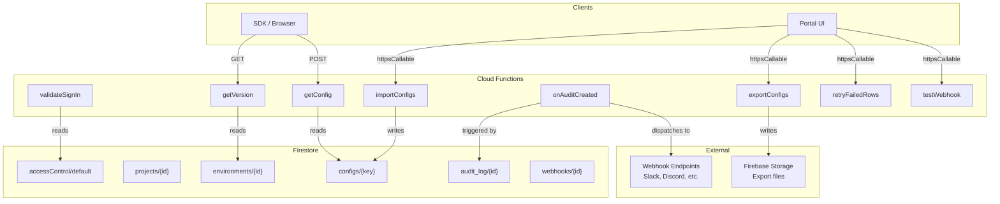
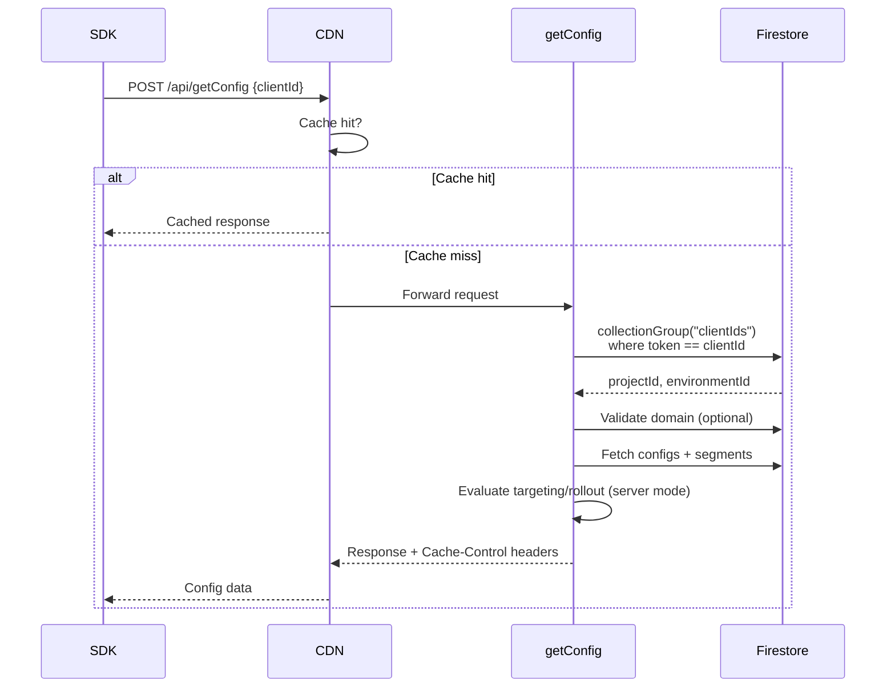
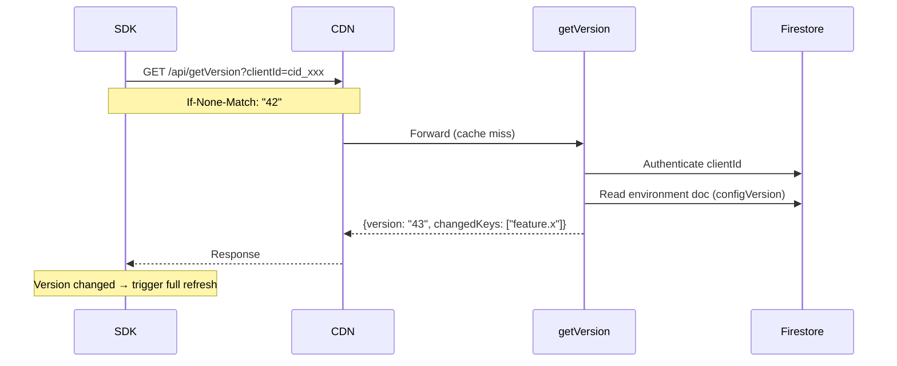
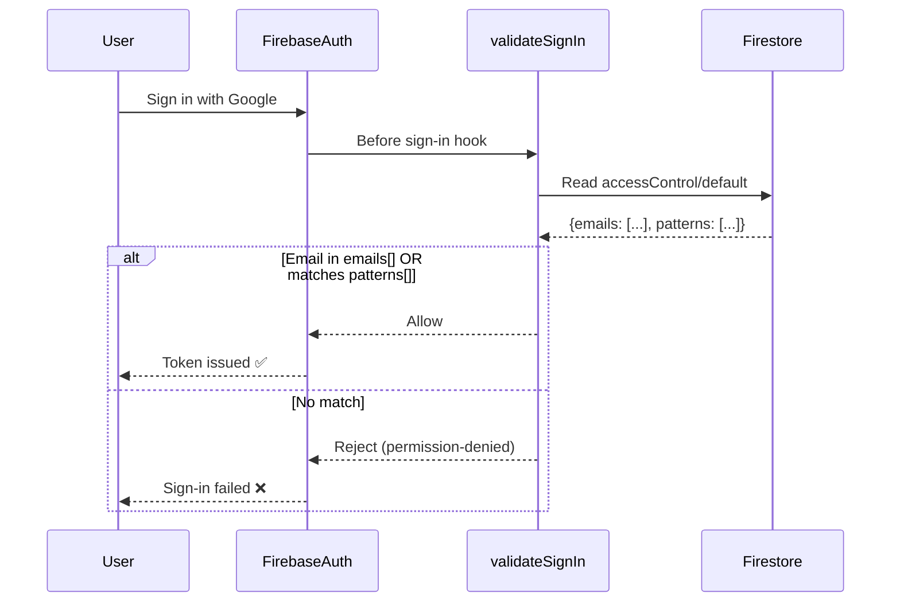
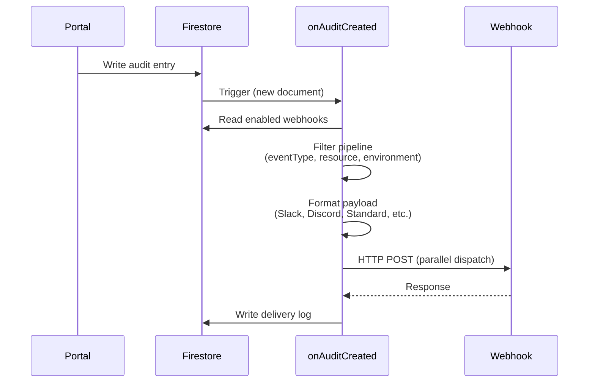
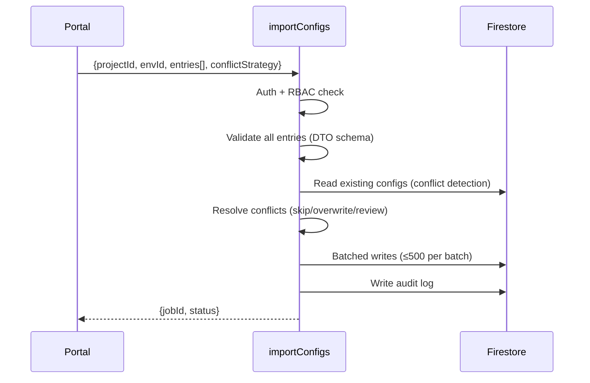
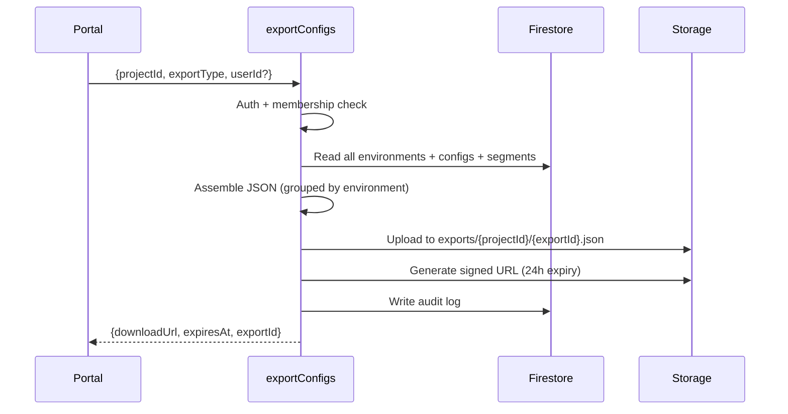

# Cloud Functions Reference

All Cloud Functions deployed as part of @jewel998/config, their purposes, and how they interact.

## Function Overview

| Function          | Type              | Trigger               | Purpose                                         |
| ----------------- | ----------------- | --------------------- | ----------------------------------------------- |
| `getConfig`       | HTTP (onRequest)  | `POST /api/getConfig` | Deliver resolved config values to the SDK       |
| `getVersion`      | HTTP (onRequest)  | `GET /api/getVersion` | Lightweight version check for polling           |
| `validateSignIn`  | Blocking          | Before user sign-in   | Enforce access control (email/domain allowlist) |
| `onAuditCreated`  | Firestore Trigger | New audit log entry   | Dispatch webhooks to configured endpoints       |
| `importConfigs`   | Callable (onCall) | Portal / programmatic | Bulk import configs with validation             |
| `exportConfigs`   | Callable (onCall) | Portal / programmatic | Export project data as JSON (GDPR)              |
| `retryFailedRows` | Callable (onCall) | Portal                | Retry/dismiss failed import entries             |
| `testWebhook`     | Callable (onCall) | Portal                | Send a test payload to a webhook URL            |

## Architecture Diagram



---

## getConfig

**Type:** HTTP onRequest (CORS enabled)  
**URL:** `POST https://your-project.web.app/api/getConfig`  
**CDN Cache:** 60s for client-mode (`svr_` keys return full data, CDN-cacheable), private for server-mode (`cid_` keys return user-specific resolved values, not cacheable)

### Flow



### Request

```json
{
  "data": {
    "clientId": "cid_xxxxx",
    "keys": ["feature.dark_mode", "app.timeout"],
    "context": {
      "userId": "user_123",
      "attributes": { "plan": "pro", "country": "US" }
    }
  }
}
```

### Response

```json
{
  "data": {
    "feature.dark_mode": true,
    "app.timeout": 5000
  },
  "version": "2",
  "timestamp": "2026-08-21T10:00:00.000Z"
}
```

### Error Codes

| Status | Code              | Cause                                             |
| ------ | ----------------- | ------------------------------------------------- |
| 400    | BAD_REQUEST       | Missing clientId                                  |
| 401    | UNAUTHORIZED      | Invalid or revoked clientId                       |
| 403    | FORBIDDEN         | Domain not in allowedDomains                      |
| 413    | PAYLOAD_TOO_LARGE | Context exceeds 10KB                              |
| 429    | TOO_MANY_REQUESTS | Rate limit exceeded (includes Retry-After header) |
| 500    | INTERNAL_ERROR    | Firestore index missing or DB error               |

---

## getVersion

**Type:** HTTP onRequest (CORS enabled)  
**URL:** `GET https://your-project.web.app/api/getVersion?clientId=cid_xxx`  
**CDN Cache:** 15s (public)

### Flow



### Response

```json
{
  "version": "43",
  "changedKeys": ["feature.dark_mode", "app.timeout"]
}
```

Supports `If-None-Match` header — returns 304 if version unchanged.

---

## validateSignIn

**Type:** Blocking Function (beforeUserSignedIn)  
**Trigger:** Runs BEFORE Firebase Auth issues a token  
**Config:** Reads `accessControl/default` document in Firestore

### Flow



### Configuration Document

**Path:** `accessControl/default`

```json
{
  "emails": ["admin@yourcompany.com", "partner@external.org"],
  "patterns": [".*@yourcompany\\.com$", ".*@subsidiary\\.io$"]
}
```

- `emails` — Exact email addresses (case-insensitive)
- `patterns` — JavaScript regex patterns tested against the email

If the document doesn't exist, all authenticated users are allowed (backward-compatible open mode).

---

## onAuditCreated

**Type:** Firestore Trigger (onDocumentCreated)  
**Trigger:** New document in `projects/{projectId}/audit_log/{entryId}`  
**Database:** `default`

### Flow



### Design Patterns Used

- **Chain of Responsibility** — Filter pipeline (event type → resource category → environment)
- **Strategy** — Formatter registry (standard, slack, discord, google-chat, ms-teams, custom)
- **Adapter** — WebhookDispatcher interface (injectable for testing)

---

## importConfigs

**Type:** Callable (onCall)  
**Auth:** Firebase Auth required (admin or editor role)

### Flow



---

## exportConfigs

**Type:** Callable (onCall)  
**Auth:** Firebase Auth required (project member)

### Flow



---

## retryFailedRows

**Type:** Callable (onCall)  
**Auth:** Firebase Auth required (admin or editor role)

Retries or dismisses failed entries from a bulk import. Re-validates each corrected entry before persisting.

---

## testWebhook

**Type:** Callable (onCall)  
**Auth:** Firebase Auth required (admin role)

Sends a sample audit event payload to a webhook URL for testing. Uses the same formatter and dispatcher as `onAuditCreated`.

---

## Deployment

Deploy all functions at once:

```bash
firebase deploy --only functions --project your-project-id --force
```

Deploy specific functions:

```bash
firebase deploy --only functions:getConfig,functions:getVersion --project your-project-id
```

### Configuration Constants

All function behavior is controlled via `functions/src/utils/constants.ts`:

| Constant                 | Default         | Description                                                   |
| ------------------------ | --------------- | ------------------------------------------------------------- |
| `API_REGION`             | `"asia-south1"` | Region for API functions. Must match your Firestore location. |
| `MAX_INSTANCES`          | `10`            | Maximum concurrent function instances                         |
| `MIN_INSTANCES`          | `0`             | Minimum warm instances (0 = free, 1+ eliminates cold starts)  |
| `RATE_LIMIT_ENABLED`     | `true`          | Whether server-side rate limiting is active                   |
| `RATE_LIMIT_CLIENT_RPM`  | `300`           | Max requests/minute for `cid_` keys                           |
| `RATE_LIMIT_SERVER_RPM`  | `120`           | Max requests/minute for `svr_` keys                           |
| `MAX_CONTEXT_SIZE_BYTES` | `10240`         | Maximum context payload size (10KB)                           |
| `CDN_CACHE_SECONDS`      | `60`            | Default CDN cache duration                                    |
| `MAX_BATCH_SIZE`         | `500`           | Firestore batch write limit                                   |

#### Changing the Region

1. Edit `API_REGION` in `functions/src/utils/constants.ts`
2. Update the `region` values in `firebase.json` hosting rewrites to match
3. Ensure your Firestore database is in the same region (cross-region adds 200-400ms per query)
4. Redeploy: `firebase deploy --only functions,hosting`

::: warning Region + Firestore must match
If your functions are in `asia-south1` but Firestore is in `us-central1`, every Firestore query adds a cross-continent round-trip. Always create your Firestore database in the same region as your functions.
:::

#### Eliminating Cold Starts

Set `MIN_INSTANCES = 1` to keep one function instance warm at all times. This eliminates the 2-4 second cold start penalty but costs ~$3-5/month on the Blaze plan.

```typescript
// functions/src/utils/constants.ts
export const MIN_INSTANCES = 1; // $0 when set to 0, ~$3-5/mo when 1
```

### Required APIs

The following GCP APIs must be enabled (the CLI enables them automatically on first deploy):

- Cloud Functions API
- Cloud Build API
- Artifact Registry API
- Eventarc API (for Firestore triggers)
- Cloud Run API

### Regions

| Function       | Region      | Why                                                               |
| -------------- | ----------- | ----------------------------------------------------------------- |
| getConfig      | us-central1 | Close to CDN edge, lowest latency                                 |
| getVersion     | us-central1 | Same as getConfig                                                 |
| onAuditCreated | us-central1 | Default (configure region in code if your Firestore is elsewhere) |
| Callables      | us-central1 | Default                                                           |
| validateSignIn | us-central1 | Global (runs before auth)                                         |

::: tip Changing Regions
All functions default to `us-central1`. If your Firestore database is in a different region, you can set the `region` option in each function's configuration object (e.g., `onDocumentCreated({ document: "...", region: "europe-west1" })`). Deploy Firestore triggers in the same region as your database for lowest latency.
:::
