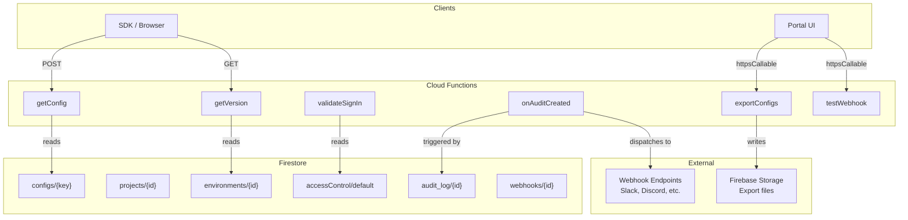
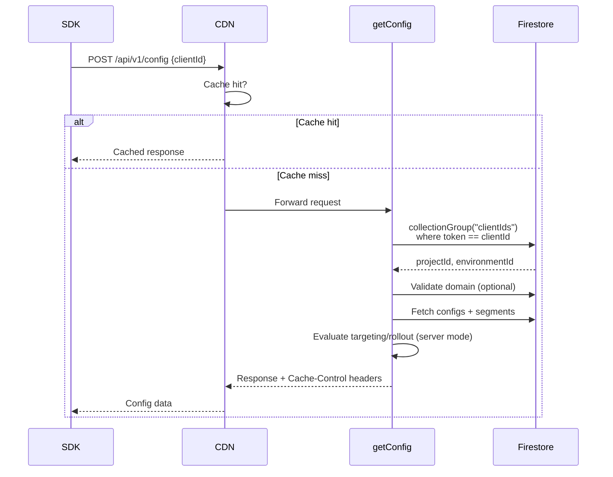
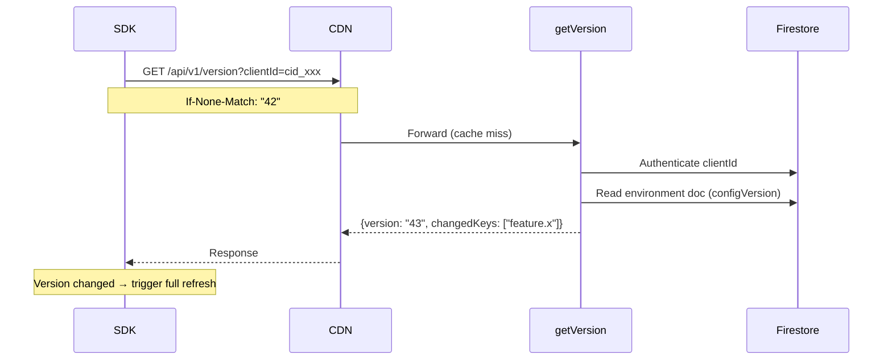
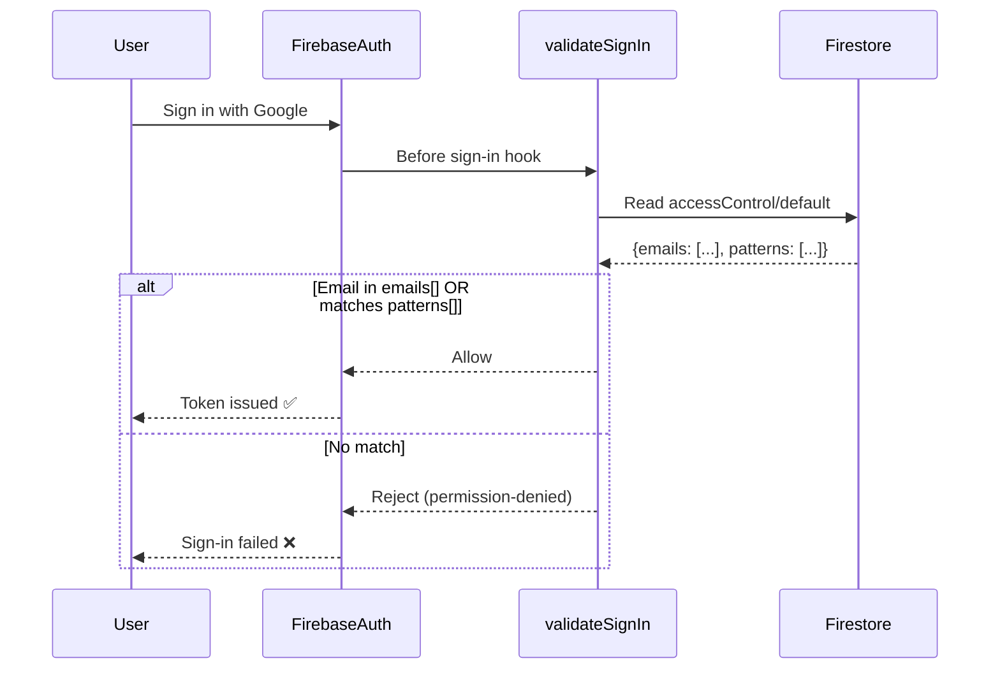
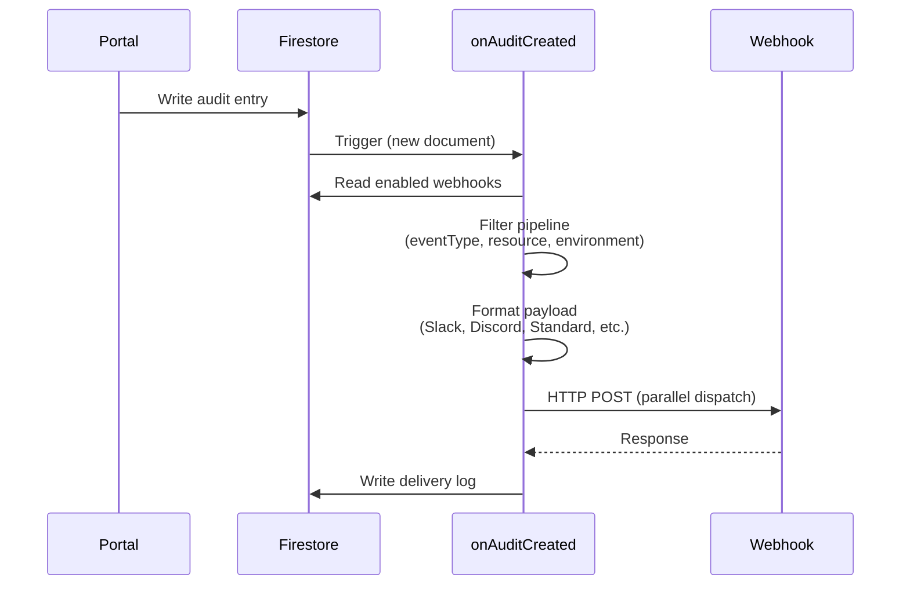
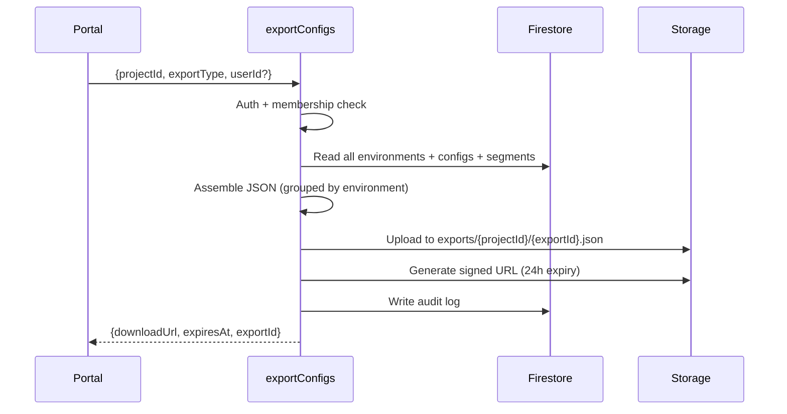

# Cloud Functions Reference

> See also: [SDK Reference](/api/) · [Self-Hosting Guide](/guide/self-hosting) · [Performance Tuning](/guide/performance)

All Cloud Functions deployed as part of @jewel998/config, their purposes, and how they interact.

## Function Overview

| Function         | Type              | Trigger               | Purpose                                         |
| ---------------- | ----------------- | --------------------- | ----------------------------------------------- |
| `getConfig`      | HTTP (onRequest)  | `POST /api/v1/config` | Deliver resolved config values to the SDK       |
| `getVersion`     | HTTP (onRequest)  | `GET /api/v1/version` | Lightweight version check for polling           |
| `validateSignIn` | Blocking          | Before user sign-in   | Enforce access control (email/domain allowlist) |
| `onAuditCreated` | Firestore Trigger | New audit log entry   | Dispatch webhooks to configured endpoints       |
| `exportConfigs`  | Callable (onCall) | Portal / programmatic | Export project data as JSON (GDPR)              |
| `testWebhook`    | Callable (onCall) | Portal                | Send a test payload to a webhook URL            |

## Architecture Diagram



---

## getConfig

**Type:** HTTP onRequest (CORS enabled)  
**URL:** `POST https://your-project.web.app/api/v1/config`  
**CDN Cache:** 60s for client-mode (`svr_` keys return full data, CDN-cacheable), private for server-mode (`cid_` keys return user-specific resolved values, not cacheable)

### Flow



### Request

```json
{
  "data": {
    "clientId": "cid_xxxxx",
    "keys": ["feature.dark_mode", "app.timeout"],
    "context": {
      "userId": "user_123",
      "attributes": { "plan": "pro", "country": "US" }
    }
  }
}
```

### Response

```json
{
  "data": {
    "feature.dark_mode": true,
    "app.timeout": 5000
  },
  "version": "2",
  "timestamp": "2026-08-21T10:00:00.000Z"
}
```

### Error Codes

| Status | Code              | Cause                                             |
| ------ | ----------------- | ------------------------------------------------- |
| 400    | BAD_REQUEST       | Missing clientId                                  |
| 401    | UNAUTHORIZED      | Invalid or revoked clientId                       |
| 403    | FORBIDDEN         | Domain not in allowedDomains                      |
| 413    | PAYLOAD_TOO_LARGE | Context exceeds 10KB                              |
| 429    | TOO_MANY_REQUESTS | Rate limit exceeded (includes Retry-After header) |
| 500    | INTERNAL_ERROR    | Firestore index missing or DB error               |

---

## getVersion

**Type:** HTTP onRequest (CORS enabled)  
**URL:** `GET https://your-project.web.app/api/v1/version?clientId=cid_xxx`  
**CDN Cache:** 15s (public)

### Flow



### Response

```json
{
  "version": "43",
  "changedKeys": ["feature.dark_mode", "app.timeout"]
}
```

Supports `If-None-Match` header — returns 304 if version unchanged.

---

## validateSignIn

**Type:** Blocking Function (beforeUserSignedIn)  
**Trigger:** Runs BEFORE Firebase Auth issues a token  
**Config:** Reads `accessControl/default` document in Firestore

### Flow



### Configuration Document

**Path:** `accessControl/default`

```json
{
  "emails": ["admin@yourcompany.com", "partner@external.org"],
  "patterns": [".*@yourcompany\\.com$", ".*@subsidiary\\.io$"]
}
```

- `emails` — Exact email addresses (case-insensitive)
- `patterns` — JavaScript regex patterns tested against the email

If the document doesn't exist, all authenticated users are allowed (backward-compatible open mode).

---

## onAuditCreated

**Type:** Firestore Trigger (onDocumentCreated)  
**Trigger:** New document in `projects/{projectId}/audit_log/{entryId}`  
**Database:** `default`

### Flow



### Design Patterns Used

- **Chain of Responsibility** — Filter pipeline (event type → resource category → environment)
- **Strategy** — Formatter registry (standard, slack, discord, google-chat, ms-teams, custom)
- **Adapter** — WebhookDispatcher interface (injectable for testing)

---

## exportConfigs

**Type:** Callable (onCall)  
**Auth:** Firebase Auth required (project member)

### Flow



---

## testWebhook

**Type:** Callable (onCall)  
**Auth:** Firebase Auth required (admin role)

Sends a sample audit event payload to a webhook URL for testing. Uses the same formatter and dispatcher as `onAuditCreated`.

---

## Deployment

Deploy all functions at once:

```bash
firebase deploy --only functions --project your-project-id --force
```

Deploy specific functions:

```bash
firebase deploy --only functions:getConfig,functions:getVersion --project your-project-id
```

### Configuration Constants

All function behavior is controlled via `functions/src/utils/constants.ts`:

| Constant                 | Default         | Description                                                  |
| ------------------------ | --------------- | ------------------------------------------------------------ |
| `API_REGION`             | `"asia-south1"` | Region for HTTP API functions (getConfig, getVersion)        |
| `MAX_INSTANCES`          | `10`            | Maximum concurrent function instances                        |
| `MIN_INSTANCES`          | `0`             | Minimum warm instances (0 = free, 1+ eliminates cold starts) |
| `RATE_LIMIT_ENABLED`     | `true`          | Whether server-side rate limiting is active                  |
| `RATE_LIMIT_CLIENT_RPM`  | `300`           | Max requests/minute for `cid_` keys                          |
| `RATE_LIMIT_SERVER_RPM`  | `120`           | Max requests/minute for `svr_` keys                          |
| `MAX_CONTEXT_SIZE_BYTES` | `10240`         | Maximum context payload size (10KB)                          |
| `CDN_CACHE_SECONDS`      | `60`            | Default CDN cache duration                                   |
| `MAX_BATCH_SIZE`         | `500`           | Firestore batch write limit                                  |

### Changing the Region

The codebase defaults to **`asia-south1` (Mumbai)**. If your users are in a different geography, you need to change the region in **three places** before deploying:

#### Step 1: Change the function region

Edit `functions/src/utils/constants.ts`:

```typescript
// Change to the region closest to your users and Firestore database
export const API_REGION = "us-central1"; // or "europe-west1", "asia-southeast1", etc.
```

This controls the region for `getConfig` and `getVersion` (the HTTP API functions).

#### Step 2: Change the hosting rewrites

Edit `firebase.json` — update the `region` field in both rewrites to match:

```json
{
  "hosting": {
    "rewrites": [
      {
        "source": "/api/v1/config",
        "function": "getConfig",
        "region": "us-central1" // ← Must match API_REGION
      },
      {
        "source": "/api/v1/version",
        "function": "getVersion",
        "region": "us-central1" // ← Must match API_REGION
      }
    ]
  }
}
```

::: danger Rewrites MUST match the function region
If the region in `firebase.json` doesn't match the region your functions are actually deployed to, the hosting rewrites will return 404 errors. These two values must always be in sync.
:::

#### Step 3: Create Firestore in the same region

Your Firestore database **must** be in the same region as your functions. When creating your Firebase project:

1. Firebase Console → Firestore Database → Create database
2. Select the **same region** as your `API_REGION`

If your Firestore is already in a different region, you cannot move it. Either:

- Change `API_REGION` to match your existing Firestore region, or
- Create a new Firestore database in the correct region (see [Backup & Restore](/guide/backup-restore))

#### Available Regions

| Region                 | Location      | Best For                              |
| ---------------------- | ------------- | ------------------------------------- |
| `asia-south1`          | Mumbai, India | South Asia (default in this codebase) |
| `us-central1`          | Iowa, USA     | North America                         |
| `europe-west1`         | Belgium       | Europe                                |
| `asia-southeast1`      | Singapore     | Southeast Asia, Oceania               |
| `asia-east1`           | Taiwan        | East Asia                             |
| `asia-northeast1`      | Tokyo         | Japan, Korea                          |
| `australia-southeast1` | Sydney        | Australia, New Zealand                |
| `southamerica-east1`   | São Paulo     | South America                         |

::: tip Choosing a region
Pick the region closest to the majority of your users. The Firebase Hosting CDN caches responses at edge nodes globally, so even users far from your function region will get fast responses on cache hits. The region mainly affects cache-miss latency and cold-start responsiveness.
:::

#### What about other functions?

The `API_REGION` constant applies to `getConfig` and `getVersion` only. The other functions (`onAuditCreated`, `exportConfigs`, etc.) deploy to the default region or can be configured individually:

| Function         | Region Behavior          | Notes                                                  |
| ---------------- | ------------------------ | ------------------------------------------------------ |
| `getConfig`      | Uses `API_REGION`        | SDK-facing, latency-critical                           |
| `getVersion`     | Uses `API_REGION`        | SDK-facing, latency-critical                           |
| `validateSignIn` | Firebase default         | Blocking function — region is managed by Firebase Auth |
| `validateCreate` | Firebase default         | Blocking function — region is managed by Firebase Auth |
| `onAuditCreated` | Firestore trigger region | Must match your Firestore database region              |
| `exportConfigs`  | Default (us-central1)    | Portal-facing, not latency-critical                    |
| `testWebhook`    | Default (us-central1)    | Portal-facing, not latency-critical                    |

For `onAuditCreated` (the Firestore trigger), ensure it's deployed in the same region as your Firestore database. If you're using a non-default region, update its configuration:

```typescript
// functions/src/triggers/on-audit-created.ts
export const createOnAuditCreated = () =>
  onDocumentCreated(
    {
      document: "projects/{projectId}/audit_log/{entryId}",
      region: "us-central1", // ← Change to match your Firestore region
    },
    async (event) => { ... }
  );
```

### Eliminating Cold Starts

Set `MIN_INSTANCES = 1` to keep one function instance warm at all times. This eliminates the 2-4 second cold start penalty but costs ~$3-5/month on the Blaze plan.

```typescript
// functions/src/utils/constants.ts
export const MIN_INSTANCES = 1; // $0 when set to 0, ~$3-5/mo when 1
```

### Required APIs

The following GCP APIs must be enabled (the CLI enables them automatically on first deploy):

- Cloud Functions API
- Cloud Build API
- Artifact Registry API
- Eventarc API (for Firestore triggers)
- Cloud Run API
