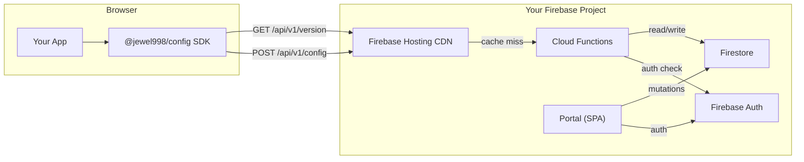
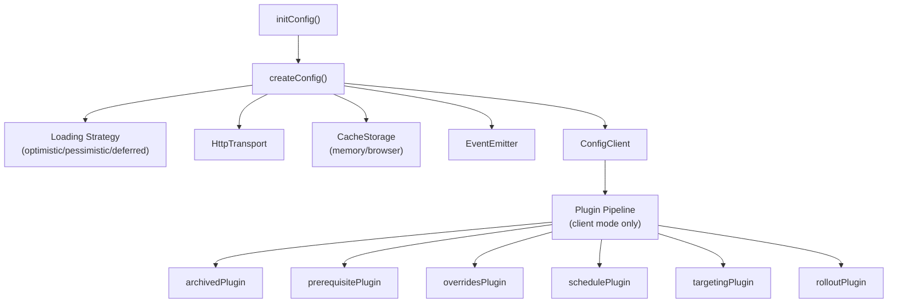

# Architecture Overview

> See also: [Cloud Functions](/api/cloud-functions) · [SDK Reference](/api/) · [Contributing](/contributing/development)

A high-level view of how @jewel998/config is structured and how the pieces interact.

## System Architecture



## Monorepo Structure

```
config/
├── apps/
│   ├── portal/       — Admin UI (React + Vite + TanStack Router + Lingui i18n)
│   ├── docs/         — Documentation site (VitePress)
│   └── landing/      — Marketing site (Astro)
├── packages/
│   ├── config/       — SDK package (@jewel998/config) — published to npm
│   └── tour/         — Declarative onboarding tour framework
├── functions/        — Firebase Cloud Functions (API + webhooks + triggers)
├── package.json      — Root workspace config
└── pnpm-workspace.yaml
```

## Package Boundaries

| Package                      | Responsibility                                      | Published?  |
| ---------------------------- | --------------------------------------------------- | ----------- |
| `@jewel998/config`           | Client SDK — fetching, caching, evaluation pipeline | ✅ npm      |
| `@jewel998/config-portal`    | Admin portal for managing flags                     | ❌ internal |
| `@jewel998/config-docs`      | Documentation site                                  | ❌ internal |
| `@jewel998/config-functions` | Cloud Functions (API, webhooks, import/export)      | ❌ internal |
| `@jewel998/tour`             | Declarative tour framework                          | ✅ npm      |

## SDK Internal Architecture



## Evaluation Pipeline

The SDK (client mode) and Cloud Functions (server mode) share the same evaluation order:

```
1. Archived     — If lifecycleState === "archived" → return undefined
2. Prerequisites — If required flags aren't met → return default
3. Overrides    — If userId has a user-specific override → return override
4. Schedule     — If activateAt <= now → return scheduled value
5. Targeting    — Evaluate rules by priority (DNF conditions) → return first match
6. Rollout      — MurmurHash3(flagKey:userId) % 100 < percentage → return rollout value
7. Default      — Return the flag's base value
```

Both the server-side evaluator (`functions/src/api/server-evaluator.ts`) and the SDK pipeline (`packages/config/src/plugins/evaluatePipeline.ts`) implement this exact order.

## Cloud Functions

| Function          | Type              | Purpose                                    |
| ----------------- | ----------------- | ------------------------------------------ |
| `getConfig`       | HTTP              | Config delivery API (CDN-cached)           |
| `getVersion`      | HTTP              | Lightweight version check (CDN-cached 15s) |
| `validateSignIn`  | Blocking Auth     | Email/domain allowlist enforcement         |
| `onAuditCreated`  | Firestore Trigger | Webhook dispatch on audit entries          |
| `importConfigs`   | Callable          | Bulk CSV/JSON import                       |
| `exportConfigs`   | Callable          | Project data export (GDPR)                 |
| `retryFailedRows` | Callable          | Retry failed import entries                |
| `testWebhook`     | Callable          | Test webhook delivery                      |

## Data Model (Firestore)

```
projects/{projectId}/
├── environments/{envId}/
│   ├── configs/{configKey}     — Flag data (value, targeting, rollout, schedule, etc.)
│   └── clientIds/{keyId}       — API keys (token, status, allowedDomains)
├── segments/{segmentId}        — Reusable audience definitions
├── webhooks/{webhookId}        — Webhook configurations
├── audit_log/{entryId}         — Immutable audit trail
└── team/{userId}               — RBAC roles

accessControl/default            — Sign-in allowlist (emails + regex patterns)
```

## Key Design Decisions

- **Server-side evaluation for client keys** — Targeting rules never reach the browser
- **Deterministic hashing for rollouts** — MurmurHash3 ensures consistent bucketing without state
- **Version-gated refresh** — Lightweight version checks minimize API costs
- **Plugin pipeline** — Tree-shakeable evaluation steps for client-side mode
- **Factory pattern** — Mutation hooks in the portal eliminate boilerplate
- **CDN caching** — Firebase Hosting CDN absorbs 99%+ of read traffic
