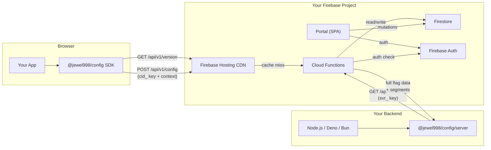
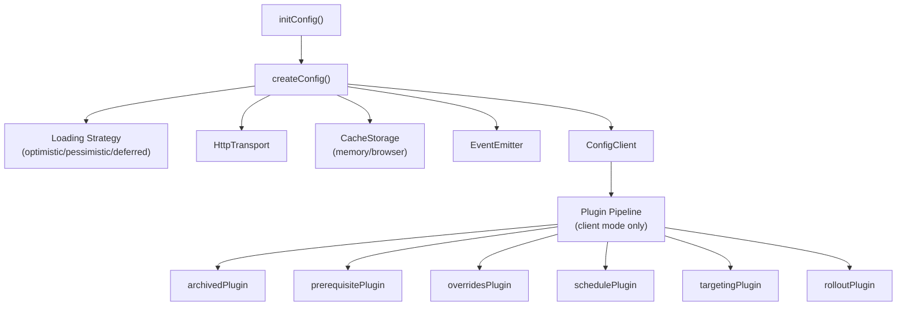
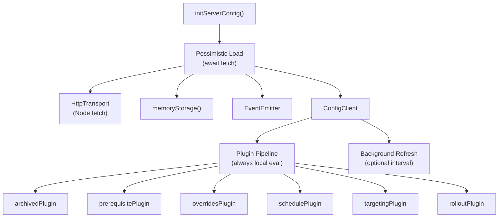
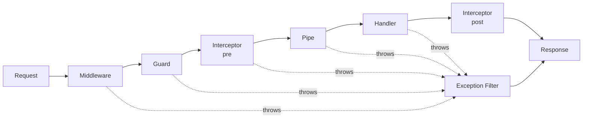

# Architecture Overview

> See also: [Cloud Functions](/api/cloud-functions) · [SDK Reference](/api/) · [Contributing](/contributing/development)

A high-level view of how @jewel998/config is structured and how the pieces interact — from the browser SDK through Firebase Hosting CDN, Cloud Functions, and Firestore.

## System Architecture



### Two Modes of Operation

| Mode                  | Key Prefix | SDK                       | Who Evaluates                | HTTP Method | Domain Check |
| --------------------- | ---------- | ------------------------- | ---------------------------- | ----------- | ------------ |
| **Client** (frontend) | `cid_`     | `@jewel998/config`        | Cloud Function (server-side) | POST        | ✅ Enforced  |
| **Server** (backend)  | `svr_`     | `@jewel998/config/server` | SDK (locally via plugins)    | GET         | ❌ Skipped   |

- **Client keys** must use POST (they send context in the body for server-side evaluation). Targeting rules are never exposed.
- **Server keys** must use GET (they fetch full flag data for local evaluation). Domain validation is skipped.

## Monorepo Structure

```
config/
├── apps/
│   ├── portal/       — Admin UI (React + Vite + TanStack Router + Lingui i18n)
│   ├── docs/         — Documentation site (VitePress)
│   └── landing/      — Marketing site (Astro)
├── packages/
│   ├── api/          — Internal micro-framework for Cloud Functions (@jewel998/api)
│   ├── config/       — SDK package (@jewel998/config) — published to npm
│   └── tour/         — Declarative onboarding tour framework
├── functions/        — Firebase Cloud Functions (API + webhooks + triggers)
├── package.json      — Root workspace config
└── pnpm-workspace.yaml
```

## Package Boundaries

| Package                      | Responsibility                                                                 | Published?  |
| ---------------------------- | ------------------------------------------------------------------------------ | ----------- |
| `@jewel998/api`              | NestJS-inspired micro-framework (decorators, guards, middleware, interceptors) | ❌ internal |
| `@jewel998/config`           | Client SDK — fetching, caching, evaluation pipeline                            | ✅ npm      |
| `@jewel998/config-portal`    | Admin portal for managing flags                                                | ❌ internal |
| `@jewel998/config-docs`      | Documentation site                                                             | ❌ internal |
| `@jewel998/config-functions` | Cloud Functions (API, webhooks, import/export)                                 | ❌ internal |
| `@jewel998/tour`             | Declarative tour framework                                                     | ✅ npm      |

## SDK Internal Architecture



### Browser SDK (`@jewel998/config`)

The default entry point is optimized for browsers:

- Optimistic loading (instant return + background fetch)
- Version-based polling every 5 minutes
- Tab visibility change detection (re-check on focus)
- `autoContext()` detects browser, OS, device, locale
- `browserStorage()` persists flags in localStorage
- Client keys (`cid_`) send context to the API for server-side evaluation

### Server SDK (`@jewel998/config/server`)

A separate entry point designed for Node.js, Deno, and Bun:

- Pessimistic loading (awaits flags before returning)
- No browser APIs (`window`, `document`, `navigator`, `localStorage`)
- Optional background refresh via configurable interval
- `serverContext()` builds context from request/session data
- Server keys (`svr_`) required — full flag data for local evaluation
- `close()` method for graceful shutdown (clears timers)
- Timer uses `.unref()` so it doesn't block process exit



### Entry Point Isolation

The package uses separate entry points to ensure **zero browser code leaks into server bundles** and vice versa:

| Entry Point                  | Environment | Browser APIs | Plugins  | Loading     |
| ---------------------------- | ----------- | ------------ | -------- | ----------- |
| `@jewel998/config`           | Browser     | ✅           | Optional | Optimistic  |
| `@jewel998/config/server`    | Node.js     | ❌           | ✅       | Pessimistic |
| `@jewel998/config/targeting` | Universal   | ❌           | —        | —           |
| `@jewel998/config/rollout`   | Universal   | ❌           | —        | —           |

This is achieved via the `exports` field in `package.json` — bundlers and Node.js resolve the correct code path automatically.

## Evaluation Pipeline

The SDK (client mode) and Cloud Functions (server mode) share the same evaluation order:

```
1. Archived     — If lifecycleState === "archived" → return undefined
2. Prerequisites — If required flags aren't met → return default
3. Overrides    — If userId has a user-specific override → return override
4. Schedule     — If activateAt <= now → return scheduled value
5. Targeting    — Evaluate rules by priority (DNF conditions) → return first match
6. Rollout      — MurmurHash3(flagKey:userId) % 100 < percentage → return rollout value
7. Default      — Return the flag's base value
```

Both the server-side evaluator (`functions/src/api/server-evaluator.ts`) and the SDK pipeline (`packages/config/src/plugins/evaluatePipeline.ts`) implement this exact order.

See [Prerequisites](/features/prerequisites), [Scheduling](/features/scheduling), [Targeting Rules](/features/targeting), and [Percentage Rollouts](/features/rollouts) for details on each step.

## Cloud Functions

| Function         | Type              | Purpose                                    |
| ---------------- | ----------------- | ------------------------------------------ |
| `getConfig`      | HTTP              | Config delivery API (CDN-cached)           |
| `getVersion`     | HTTP              | Lightweight version check (CDN-cached 15s) |
| `validateSignIn` | Blocking Auth     | Email/domain allowlist enforcement         |
| `onAuditCreated` | Firestore Trigger | Webhook dispatch on audit entries          |
| `exportConfigs`  | Callable          | Project data export (GDPR)                 |
| `testWebhook`    | Callable          | Test webhook delivery                      |

### API Framework (`@jewel998/api`)

HTTP Cloud Functions use a custom NestJS-inspired micro-framework. Each endpoint is a decorated class:

```typescript
@Methods("GET", "POST")
@UseMiddleware(new ExtractClientIdMiddleware(), new RateLimitMiddleware())
@UseGuards(new AuthenticateGuard(), new ValidateDomainGuard(), new FetchConfigsGuard())
class GetConfigHandler extends RequestHandler {
  handle(ctx: RequestContext): HandlerResponse { ... }
}

export const getConfig = onRequest(config, createHandler(GetConfigHandler, { ... }));
```

Request lifecycle (same as NestJS):



Guards (per endpoint, plug-and-play):

| Guard                       | Responsibility                                           |
| --------------------------- | -------------------------------------------------------- |
| `ExtractClientIdMiddleware` | Parse clientId, determine key type (middleware)          |
| `RateLimitMiddleware`       | In-memory rate limiting, zero Firestore I/O (middleware) |
| `ValidateKeyMethodGuard`    | Enforce cid_→POST, svr_→GET                              |
| `ExtractContextGuard`       | Parse userContext + requestedKeys from body              |
| `AuthenticateGuard`         | Validate key via Firestore, resolve project/env          |
| `ValidateDomainGuard`       | Check origin allowlist (skips for svr_ keys)             |
| `FetchConfigsGuard`         | Load configs + segments + version from Firestore         |

## Data Model (Firestore)

```
projects/{projectId}/
├── environments/{envId}/
│   ├── configs/{configKey}     — Flag data (value, targeting, rollout, schedule, etc.)
│   └── clientIds/{keyId}       — API keys (token, status, allowedDomains)
├── segments/{segmentId}        — Reusable audience definitions
├── webhooks/{webhookId}        — Webhook configurations
├── audit_log/{entryId}         — Immutable audit trail
└── team/{userId}               — RBAC roles

accessControl/default            — Sign-in allowlist (emails + regex patterns)
```

## Key Design Decisions

- **Custom micro-framework (`@jewel998/api`)** — NestJS-inspired decorator pattern (`@Methods`, `@UseGuards`, `@UseMiddleware`) without NestJS's DI container overhead. Zero cold-start penalty.
- **Server-side evaluation for client keys** — Targeting rules never reach the browser
- **Method enforcement per key type** — `cid_` keys must POST (need body for context), `svr_` keys must GET (fetch full data for local eval)
- **Separate entry points for browser/server** — `@jewel998/config/server` imports zero browser code
- **Domain validation skipped for server keys** — `ValidateDomainGuard` self-skips when `ctx.isServerKey` is true
- **In-memory rate limiting** — Per-instance Map-based counters, zero Firestore I/O, rejects before authentication
- **Pessimistic loading for servers** — Server SDKs await flag data before returning
- **Deterministic hashing for rollouts** — MurmurHash3 ensures consistent bucketing without state
- **Version-gated refresh** — Lightweight version checks minimize API costs
- **Plugin pipeline** — Tree-shakeable evaluation steps for client-side and server-side mode
- **CDN caching** — Firebase Hosting CDN absorbs 99%+ of read traffic
- **`.unref()` on server timers** — Background refresh intervals don't prevent Node.js process exit
- **Webhook provider hierarchy** — `WebhookFormatter` (Template Method) separates notification content from platform envelope; `WebhookProvider` owns dispatch lifecycle; `WebhookProviderFactory` (Factory) maps format strings to provider classes. Adding a new platform = one formatter + one provider + one registry entry.
