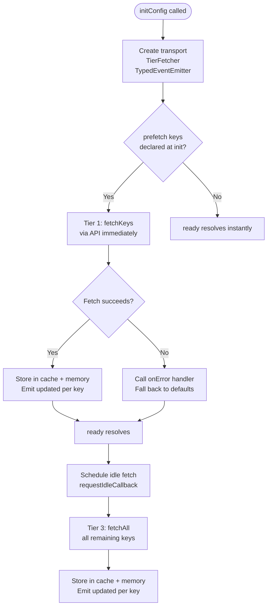
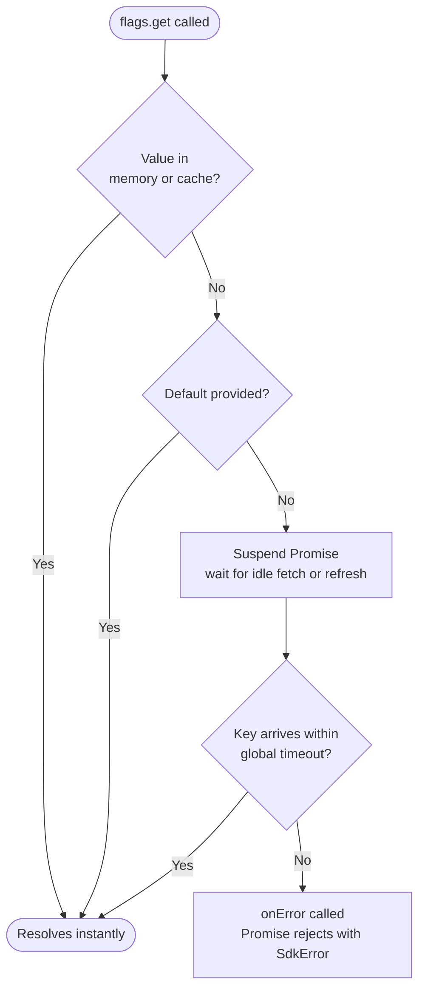
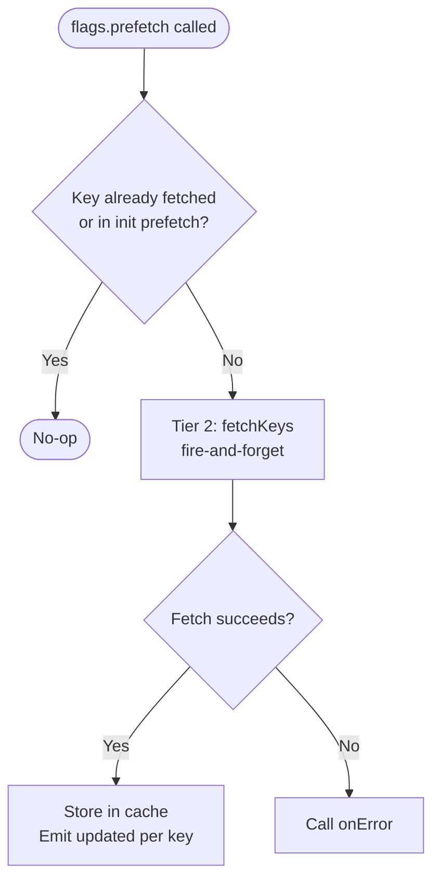
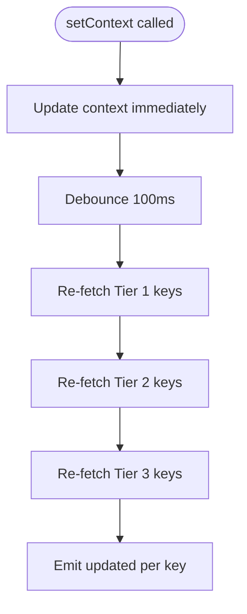

# SDK Fetch Flow

> See also: [Getting Started](/guide/getting-started) · [SDK Reference](/api/) · [Storage & Caching](/guide/storage)

The `initConfig` SDK uses a three-tier priority fetch model designed for projects with large flag sets (100s–1000s of keys). Only the keys you need are fetched first — everything else fills in progressively in the background.

## Three-Tier Model

```
Tier 1 — PREFETCH (init)    Declared via prefetch: [...] at initConfig time.
                             Fetched immediately. ready() blocks until complete.

Tier 2 — PAGE (runtime)     Declared via flags.prefetch(keys) per route/component.
                             Fire-and-forget. Emits "updated" per key on completion.

Tier 3 — IDLE               Full fetchAll() during browser idle time via
                             requestIdleCallback (fallback: setTimeout 200ms).
                             Fills in all remaining keys.
```

## Initialisation Flow



## `flags.get(key)` Resolution



## `flags.prefetch(keys)` — Tier 2



## `flags.setContext()` Re-fetch

When `setContext()` is called, the SDK re-fetches only already-fetched keys (not all 1000+ keys) — debounced 100ms — in tier order:



## `flags.refresh()` — Manual Re-fetch

`refresh()` re-fetches all already-fetched keys in tier order and resolves when complete.

## Version Polling

Every `pollInterval` (default 5 min) the SDK polls `/v1/version`. On version change, `refresh()` is called internally — only fetching already-fetched keys, never triggering a full re-fetch of all keys.

## Key Deduplication

| Scenario                                                   | Behaviour                                              |
| ---------------------------------------------------------- | ------------------------------------------------------ |
| Key in init `prefetch` + also passed to `flags.prefetch()` | Skipped in runtime call — already tracked under Tier 1 |
| `flags.prefetch()` called twice with same key              | Second call is a no-op                                 |
| `get()` called on a key in-flight via prefetch             | Promise suspends and resumes when the fetch completes  |
| `get()` called with a default value                        | Resolves instantly — no network wait                   |

## Related

- [Getting Started](/guide/getting-started) — How to declare `prefetch` keys and use `ready()`
- [SDK Reference](/api/) — Full `Flags` interface including `get()`, `prefetch()`, `ready()`
- [Storage & Caching](/guide/storage) — How the cache layer interacts with the tier model
