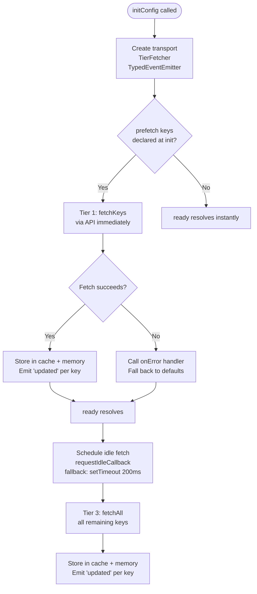
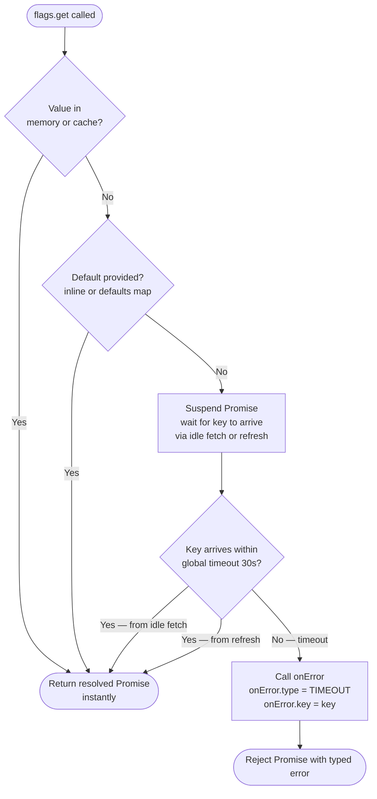
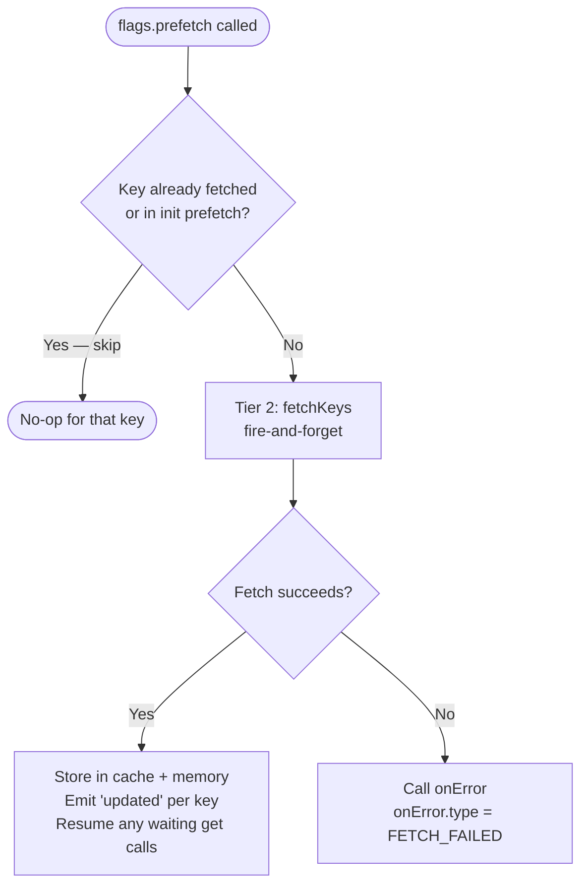
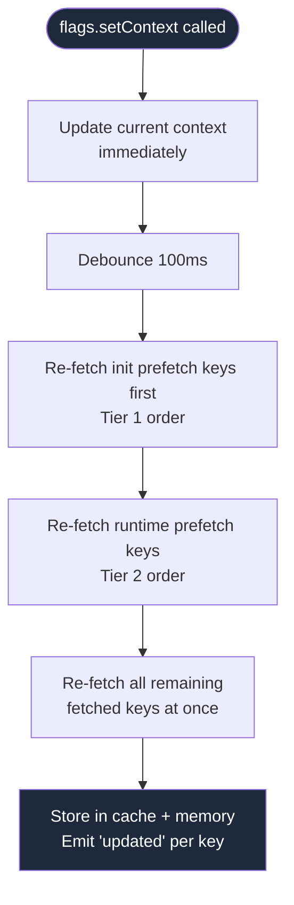
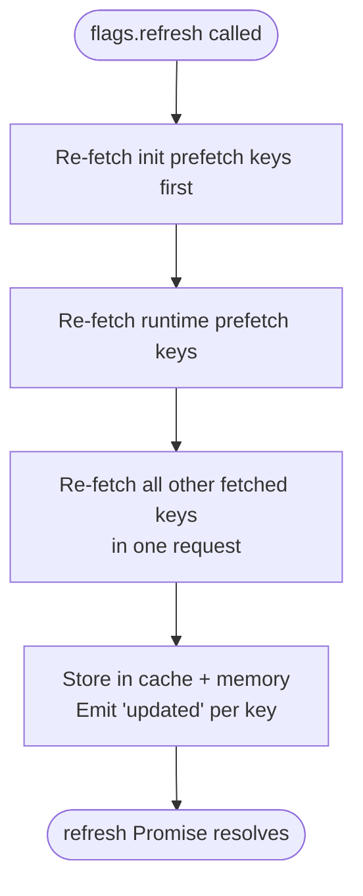
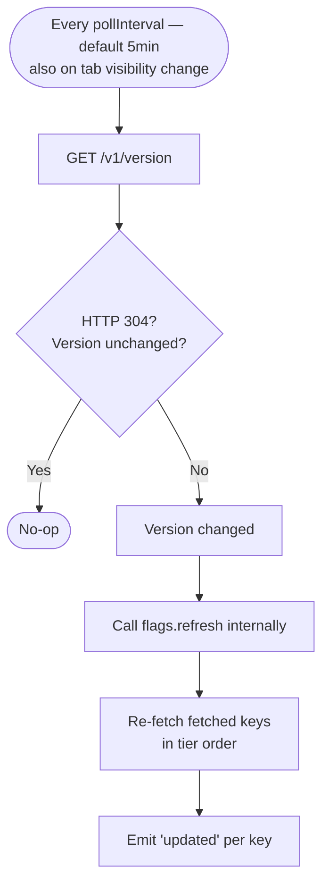

# SDK Fetch Flow

This document describes the 3-tier priority fetching model used by `initConfig`.

## Overview

```
Tier 1 — PREFETCH (init)   Declared at initConfig, fetched immediately.
                            ready() resolves when this completes.

Tier 2 — PREFETCH (runtime) Declared via flags.prefetch(keys) per route/component.
                            Fire-and-forget. Emits "updated" per key on completion.

Tier 3 — IDLE              Full fetchAll() during browser idle time via
                            requestIdleCallback (fallback: setTimeout 200ms).
                            Fills in all remaining keys.
```

---

## Initialisation Flow



---

## Runtime: `flags.get(key)`



---

## Runtime: `flags.prefetch(keys)`



---

## Runtime: `flags.setContext(ctx)`



> Caller does not await setContext. Responsibility is on the developer
> to call setContext at the right time and subscribe to "updated" if
> they need to react to the re-fetch completing.

---

## Runtime: `flags.refresh()`



---

## Version Polling



---

## Key Deduplication Rules

| Scenario                                                | Behaviour                                                       |
| ------------------------------------------------------- | --------------------------------------------------------------- |
| Key in init `prefetch` + passed to runtime `prefetch()` | Skipped in runtime call — already tracked under Tier 1          |
| Key in runtime `prefetch()` called twice                | Second call is a no-op for that key                             |
| `get()` called on a key that is in-flight via prefetch  | Promise suspends and resumes when the in-flight fetch completes |
| `get()` called with a default value                     | Resolves instantly — no network wait regardless of tier         |

---

## Error Types (`onError`)

```ts
initConfig({
  onError: (error) => {
    error.type; // "TIMEOUT" | "FETCH_FAILED" | "KEY_NOT_FOUND" | "AUTH" | "RATE_LIMITED"
    error.key; // which key triggered the error (undefined for non-key errors)
    error.cause; // the underlying Error object
  },
});
```

| Type            | When                                                      |
| --------------- | --------------------------------------------------------- |
| `TIMEOUT`       | `get()` waited longer than global timeout with no default |
| `FETCH_FAILED`  | Network error or non-2xx response during any tier fetch   |
| `KEY_NOT_FOUND` | Key requested via `get()` does not exist in the project   |
| `AUTH`          | 401/403 from the API — circuit breaker opens              |
| `RATE_LIMITED`  | 429 from the API                                          |

---

## Complete Interface

```ts
interface InitConfigOptions {
  clientId: string;
  prefetch?: string[]; // Tier 1 — fetched immediately, blocks ready()
  defaults?: Record<string, unknown>; // Fallback values, returned instantly
  context?: EvaluationContext;
  baseUrl?: string;
  storage?: CacheStorage;
  pollInterval?: number; // Default: 300_000 (5 min). 0 = disabled.
  timeout?: number; // Default: 30_000 (30s). Global for all get() calls.
  onError?: (error: ConfigError) => void; // Global error handler — called on every error.
}

interface Flags {
  // Resolves when Tier 1 (init prefetch) keys are ready.
  // Resolves instantly if no prefetch keys declared.
  ready(): Promise<void>;

  // Tier 2 fetch hint — fire-and-forget.
  // Keys already fetched or in init prefetch are skipped (no duplicate fetches).
  prefetch(keys: string[]): void;

  // Get a typed value.
  //
  // Resolution order:
  //   1. Memory / cache hit → resolves instantly
  //   2. Inline default or defaults map hit → resolves instantly
  //   3. No default → suspends until idle fetch or refresh delivers the key
  //
  // On timeout (global, default 30s):
  //   - onError is called with { type: "TIMEOUT", key, cause }
  //   - Promise rejects with the same typed error
  //   - Caller handles with try/catch or .catch()
  get<T = unknown>(key: string): Promise<T>;
  get<T = unknown>(key: string, defaultValue: T): Promise<T>;

  // Returns a snapshot of all currently fetched values merged with defaults.
  // Does not wait for any in-flight fetch — returns current state only.
  all(): Promise<Record<string, unknown>>;

  // Fire-and-forget. Updates context immediately, debounced 100ms re-fetch.
  // Re-fetches all fetched keys in tier order with new context.
  // Subscribe to "updated" events to react when re-fetch completes.
  setContext(context: EvaluationContext): void;

  // Re-fetches all fetched keys in tier order (init prefetch first, then rest).
  // Resolves when all re-fetches complete.
  refresh(): Promise<void>;

  // Key-specific subscription — fires when that exact key's value changes.
  on(event: `updated:${string}`, cb: (value: unknown) => void): void;
  // Batch subscription — fires when any keys update (one event per fetch batch).
  on(event: "updated", cb: (payload: { keys: string[] }) => void): void;
  on(event: "fetchError", cb: (payload: FetchErrorPayload) => void): void;
  off(event: string, cb: Function): void;
}

interface ConfigError {
  type: "TIMEOUT" | "FETCH_FAILED" | "KEY_NOT_FOUND" | "AUTH" | "RATE_LIMITED";
  key?: string; // which key triggered the error (undefined for non-key errors)
  cause?: Error; // underlying Error object
}
```

---

## Usage Examples

```ts
// Init — declare keys needed immediately
const flags = initConfig({
  clientId: "cid_xxx",
  baseUrl: "https://your-project.web.app/api",
  prefetch: ["app.maintenance_mode", "feature.auth_provider"],
  defaults: {
    "feature.dark_mode": false,
    "app.upload_limit": 50,
  },
  context: autoContext({ userId: "user_123", plan: "pro" }),
  timeout: 30_000,
  onError: (err) => console.error(`[flags] ${err.type} — ${err.key ?? "general"}`),
});

// Wait for Tier 1 keys before first render
await flags.ready();

// In a route/page component — declare page-level keys (Tier 2)
flags.prefetch(["feature.new_checkout", "app.upload_limit"]);

// Get a value — resolves from cache/default instantly,
// or suspends until idle fetch / refresh delivers it
const darkMode = await flags.get<boolean>("feature.dark_mode"); // instant (has default)
const checkout = await flags.get<boolean>("feature.new_checkout"); // waits if not yet fetched

// Get with inline default — always instant
const limit = await flags.get<number>("app.upload_limit", 50);

// Get with no default, no prefetch — suspends until idle fetch, rejects on timeout
try {
  const experiment = await flags.get<string>("feature.experiment_variant");
} catch (e) {
  // e.type === "TIMEOUT" — idle fetch didn't deliver this key within 30s
}

// React to any value changing
flags.on("updated", ({ keys }) => rerender());

// React to one specific key changing
flags.on("updated:feature.dark_mode", (value) => applyTheme(value));

// Context change (login, plan upgrade)
flags.setContext(autoContext({ userId: "user_456", plan: "enterprise" }));
// re-fetches all fetched keys in background, emits "updated" per key

// Snapshot of everything fetched so far
const all = await flags.all(); // current state only, no waiting
```
